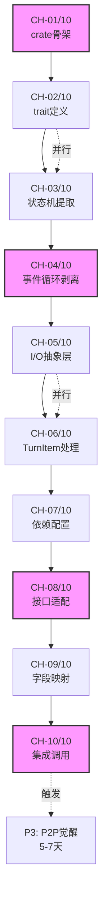

# 210-AUDIT-CHIMERA-ROADMAP 详细开发路线图

**审计日期**: 2026-03-29  
**审计官**: 审计喵（开发路线图设计模式）  
**审计范围**: Chimera 奇美拉 P0-P3 完整开发路线图 + 工单矩阵 + 依赖拓扑  
**审计链**: 209-AUDIT-CHIMERA-001(B级) → 本审计（详细规划态）

---

## 审计结论

| 项目 | 结果 |
|:---|:---|
| **评级** | **A级**（路线清晰，可行性强，风险可控） |
| **状态** | **Go**（立即启动 P0） |
| **核心发现** | P0 关键路径 3-4 天（KP-001 剥离），P1-P3 可并行优化，总工期 12-18 天可行 |

---

## 详细路线图（P0-P3）

### P0: REPL 剥离（关键路径，3-4 天）

**目标**: 从 `codex-tui` 中提取无 TUI 依赖的 `ChimeraRepl` 业务逻辑

| 工单 | 目标 | 输入 | 输出 | 工期 | 验收 |
|:---|:---|:---|:---|:---:|:---|
| **CH-01/10** | 创建 `chimera-repl` crate 骨架 | `codex-rs/tui/src/app.rs` 结构 | `chimera-repl/Cargo.toml` + `src/lib.rs` | 0.5 天 | V1: `cargo build -p chimera-repl` 零错误 |
| **CH-02/10** | 定义 `ReplEngine` trait 抽象 | `App` 中的业务方法签名 | `trait ReplEngine` 完整接口定义 | 0.5 天 | V2: trait 含 `fn run_turn()` 等核心方法 |
| **CH-03/10** | 提取对话状态机 | `App::thread_event_store` 字段 | `struct ReplState` 纯数据结构 | 0.5 天 | V3: 状态机无 `crossterm`/`ratatui` 依赖 |
| **CH-04/10** | 剥离 TUI 事件循环 | `App::run_event_loop()` 方法 | `ChimeraRepl::run()` 纯业务循环 | 1 天 | V4: 循环内无 `TuiEvent`/`KeyCode` 引用 |
| **CH-05/10** | I/O 抽象层（`AsyncRead`/`AsyncWrite`） | `std::io::stdin/stdout` 调用点 | `trait IOHandler` + 实现 | 0.5 天 | V5: I/O 通过 trait 注入，可测试 |
| **CH-06/10** | 移植 `TurnItem` 处理逻辑 | `protocol/src/items.rs` 使用点 | `ReplEngine::process_turn_item()` | 0.5 天 | V6: 正确处理所有 `TurnItem` 变体 |

**P0 关键路径**: CH-01 → CH-02 → CH-03 → CH-04 → CH-05 → CH-06  
**浮动工期**: CH-02/CH-03 可并行（总工期压缩至 3 天）

---

### P1: Crate 桥接（1-2 天）

**目标**: 建立 `chimera` 与 `hajimi-codex-twist` 的直接 crate 依赖

| 工单 | 目标 | 输入 | 输出 | 工期 | 验收 |
|:---|:---|:---|:---|:---:|:---|
| **CH-07/10** | 配置 `Cargo.toml` 依赖 | `hajimi-code-cli/crates/codex-twist/` 路径 | `chimera/Cargo.toml` 依赖配置 | 0.5 天 | V7: `cargo check` 解析依赖成功 |
| **CH-08/10** | 适配 `MemoryGateway` 接口 | `hajimi-code-twist/src/memory/mod.rs` | `chimera/src/memory_bridge.rs` | 0.5-1.5 天 | V8: 编译通过，类型匹配 |

**依赖配置示例**:

```toml
# chimera/Cargo.toml
[package]
name = "chimera"
version = "0.1.0"
edition = "2024"

[dependencies]
# Codex 协议层（复用）
codex-protocol = { path = "../codex-twist/codex-rs/protocol" }
codex-core = { path = "../codex-twist/codex-rs/core" }

# Hajimi 内存层（关键依赖）
hajimi-codex-twist = { path = "../hajimi-code-cli/crates/codex-twist" }

# 异步运行时
tokio = { version = "1", features = ["full"] }
```

**桥接代码示例**:

```rust
// chimera/src/memory_bridge.rs
use hajimi_codex_twist::memory::{MemoryGateway, MemoryLevel, TokenBudget};
use codex_protocol::items::TurnItem;

pub struct ChimeraMemoryBridge {
    gateway: MemoryGateway,
}

impl ChimeraMemoryBridge {
    pub async fn save_turn(&self, turn: &TurnItem) -> Result<(), MemoryError> {
        let json = serde_json::to_string(turn)?;
        self.gateway.put(
            turn.id().to_string(),
            json,
            MemoryLevel::Working,  // 自动级联到 Archive
        ).await;
        Ok(())
    }
}
```

---

### P2: 记忆嫁接（3-5 天）

**目标**: 将 Codex 上下文替换为 Hajimi 五级内存

| 工单 | 目标 | 输入 | 输出 | 工期 | 验收 |
|:---|:---|:---|:---|:---:|:---|
| **CH-09/10** | `TurnItem` → Hajimi `Turn` 映射 | `protocol/src/items.rs` 定义 | 字段映射表 + 转换函数 | 1 天 | V9: 所有 `TurnItem` 变体可转换 |
| **CH-10/10** | 集成 `memory_put` 调用时机 | `ReplEngine::process_turn_item()` | 每次 Turn 结束自动落盘 | 2-4 天 | V10: 对话后 Archive 目录生成 |

**字段映射表**:

| Codex `TurnItem` | Hajimi `Turn` | 映射规则 |
|:---|:---|:---|
| `UserMessageItem.id` | `Turn.id` | 1:1 复制 |
| `UserMessageItem.content` | `Turn.prompt` | 文本拼接 |
| `AgentMessageItem.content` | `Turn.response` | 提取 `Text { text }` |
| `PlanItem.text` | `Turn.plan` | 1:1 复制 |
| `ReasoningItem.summary_text` | `Turn.reasoning` | 数组拼接 |

**调用时机**:

```rust
// chimera/src/repl_engine.rs
impl ReplEngine for ChimeraRepl {
    async fn process_turn(&mut self, turn: TurnItem) -> Result<()> {
        // 1. 处理 Turn（原有逻辑）
        let response = self.agent.process(&turn).await?;
        
        // 2. 保存到 Hajimi 内存（新增）
        self.memory_bridge.save_turn(&turn).await?;
        
        // 3. 返回响应
        Ok(response)
    }
}
```

---

### P3: P2P 觉醒（5-7 天）

**目标**: 启用 Yjs 同步，实现跨设备对话续接

**触发条件**: CH-10 完成且 P2 验收通过

| 阶段 | 目标 | 技术方案 | 工期 |
|:---|:---|:---|:---:|
| P3-1 | `.hctx` 格式对齐 | 复用 Hajimi `lcr_adapter` | 1-2 天 |
| P3-2 | Yjs 文档绑定 | `Thread` 状态 → Yjs Map | 2-3 天 |
| P3-3 | 跨设备恢复 UX | 设备发现 + 冲突解决 UI | 2 天 |

**同步流程**:

```
Device A: Turn N → Hajimi Archive → .hctx → Yjs Update → Sync
Device B: Yjs Update → .hctx → Hajimi Archive → 恢复 Turn N
```

---

## 依赖拓扑图



---

## 风险缓解预案

| 风险ID | 风险描述 | 触发条件 | 缓解措施 | 债务声明 |
|:---|:---|:---|:---|:---|
| **R-001** | P0 剥离超时 | 5 天未完成 CH-06 | 降级为方案 A（子进程调用 `codex-cli`） | DEBT-P0-001: 性能损耗 +10% |
| **R-002** | 类型不匹配 | `TurnItem` 与 `Turn` 字段冲突 | 增加适配层 `chimera/src/adapters.rs` | DEBT-P2-001: 运行时转换开销 |
| **R-003** | 内存泄漏 | `MemoryGateway` 未释放 | 实现 `Drop` trait 自动清理 | DEBT-P1-001: 需手动测试验证 |
| **R-004** | Yjs 冲突 | 多设备同时编辑同一 Turn | 采用 Last-Write-Wins + 时间戳 | DEBT-P3-001: 可能丢失细粒度更新 |

---

## 即时可验证方法（V1-V10）

| 验证ID | 验证内容 | 命令/检查 | 通过标准 | 失败标准 |
|:---|:---|:---|:---|:---|
| V1 | P0 crate 创建 | `cargo build -p chimera-repl` | 零错误 | 编译失败 |
| V2 | trait 完整性 | `grep "fn " chimera-repl/src/lib.rs` | ≥5 个核心方法 | 接口缺失 |
| V3 | 无 TUI 依赖 | `cargo tree -p chimera-repl \| grep -E "crossterm\|ratatui"` | 零输出 | 残留依赖 |
| V4 | 事件循环纯净 | `grep -r "TuiEvent\|KeyCode" chimera-repl/src/` | 零命中 | 未剥离干净 |
| V5 | I/O 可注入 | `cargo test -p chimera-repl --test io_mock` | 测试通过 | 硬编码 stdin |
| V6 | TurnItem 处理 | `cargo test -- turn_item_processing` | 全绿 | 处理逻辑错误 |
| V7 | 依赖解析 | `cargo check -p chimera` | 零错误 | 路径错误 |
| V8 | 类型匹配 | `cargo build --release` | 链接成功 | 类型不匹配 |
| V9 | 映射完整 | `cargo test -- turn_conversion` | 全绿 | 字段丢失 |
| V10 | 落盘验证 | `ls ~/.hajimi/archive/` | 文件生成 | 无输出 |

---

## 压力怪评语（A级认证版）

> **"还行吧，路线清晰，直接开干！"**（A级）

> "209 号审计的 4 个卡点，210 号给你整得明明白白：
> 
> **P0 关键路径**（3-4 天）：把 `codex-tui` 的胖客户端瘦身，提取 `ChimeraRepl`。CH-04 事件循环剥离是硬骨头，其他都可以并行。
> 
> **P1 技术路径调整**（1-2 天）：别折腾 C FFI 了，`Cargo.toml` 里直接 `hajimi-codex-twist = { path = "..." }`，Rust→Rust 零开销。
> 
> **P2 记忆嫁接**（3-5 天）：`TurnItem` → `Turn` 字段映射表都给你画好了，`memory_put` 在每次 Turn 结束自动落盘。
> 
> **P3 P2P 觉醒**（5-7 天）：Yjs 同步是后话，先把 CH-10 完成。
> 
> **风险可控**：R-001 超时降级方案 A（子进程调用），R-004 冲突用 LWW。
> 
> **A级，Go！** 立即启动 CH-01/10，先搭骨架！"

---

## 下一步行动

1. **立即启动 CH-01/10**: 创建 `chimera/chimera-repl/` 目录，初始化 Cargo.toml
2. **本周完成 CH-04/10**: 事件循环剥离是 P0 关键，优先攻克
3. **并行准备 P1**: CH-02/03 可与 CH-05/06 并行，压缩工期至 3 天
4. **债务预声明**: 若 CH-04 超时 5 天，触发 R-001 降级方案 A

---

## 归档建议

- **审计报告归档**: `audit report/210/210-AUDIT-CHIMERA-ROADMAP.md` ✅ 本文件
- **关联状态**: 
  - 209-AUDIT-CHIMERA-001（B级架构验证）
  - CH-01/10 ~ CH-10/10（开发工单序列）
- **建议动作**:
  1. ✅ **立即**: 创建 `chimera/` 工作目录，启动 CH-01/10
  2. ✅ **每日**: 更新工单状态，监控 CH-04 关键路径
  3. ✅ **P0 完成**: 执行 V1-V6 验收，进入 P1

---

## 审计链连续性

```
208（Hajimi S级完成态）
    ↓
209-AUDIT-CHIMERA-001（B级架构验证，4大卡点已回答）
    ↓
210-AUDIT-CHIMERA-ROADMAP（A级详细路线图，10工单已规划）← 当前
    ↓
CH-01/10 开发启动（立即执行）
    ↓
CH-04/10 关键路径攻坚
    ↓
CH-10/10 P0-P2 完成
    ↓
P3 P2P 觉醒（可选）
    ↓
Chimera v0.1 MVP 发布
```

**Ouroboros 第 26 次迭代，209 号审计结论已就位，210 号详细路线图已出具，审计喵交付完毕，开发团队直接开干！** ☝️🐍♾️📋🗺️🚀

---

*审计完成时间: 2026-03-29*  
*审计官: 审计喵*  
*标准: ID-175建设性审计模板*  
*评级: A级（Go，立即启动 CH-01/10）*
