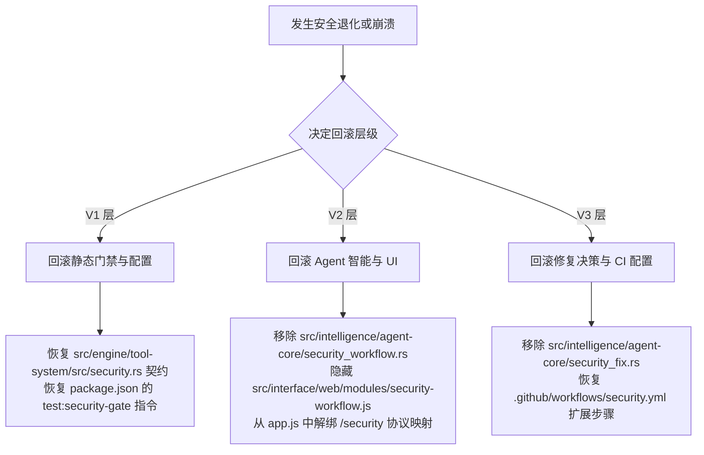

# B-17 Security Workflow Closure (最终收卷与交接包)

> **当前状态**: ✅ **Day 15 Final Closure & Handoff Completed**  
> **分支**: `codex/security-workflow-day01`  
> **当前 HEAD**: `d79113b925bb5993da986a6619320be7207b6967` (基于 Day 14 最小补丁提交)  
> **文档维护时间**: 2026-05-24

---

## 1. Security Workflow 状态矩阵 (Status Matrix)

Hajimi 安全工作流（Security Workflow）经历了 V1-V3 迭代周期。以下是核心交付项的状态及其证据依据：

| 交付模块 | 状态 | 状态定义与证据说明 |
|:---|:---:|:---|
| **V1 Gate (安全门禁 V1)** | `PASS` | 本地测试通过。`test:security-gate` 依赖的规则集（包含 CSP 校验、Tauri 全局过滤、DOM 危险 API 扫描、Shell 安全白名单与 Path 门禁等）在本地测试完美收口，108 项历史 DOM 风险全部登记为合理 allowlist 警告。 |
| **V1 Schema (数据定义与 Tool 契约)** | `PASS` | 本地测试通过。`src/engine/tool-system/src/security.rs` 内置的 `Finding`, `Evidence`, `ValidationReceipt` 契约结构及 JSON 报告输出完全兼容 legacy 结构。本地 `cargo test -p engine-tool-system security` 单元测试通过。 |
| **V2 Agent Workflow (审计与分析流程)** | `PASS` | 本地测试通过。`src/intelligence/agent-core/security_workflow.rs` 中的编排器和 threat model、finding discovery、attack path analysis、validation 决策逻辑运行正常。本地 `cargo test -p intelligence-agent-core security_workflow` 单元测试通过。 |
| **V2 UI (安全面板面板)** | `PARTIAL` | **保留 WebView 活跃债务**。Right Inspector 右侧栏的安全面板基础渲染和 CSS Token 已就位，且交互式 Slash `/security` 协议逻辑在 JS 层已解析完毕。已实现字段采用 `textContent` 与 `createTextNode` 渲染。但由于真机交互点击与 WebView 真机环境测试处于挂起状态，当前不宣称 `DONE`。 |
| **V3 Fix/Revalidation (自动修复与复测)** | `PARTIAL` | **干跑门禁限制**。`src/intelligence/agent-core/security_fix.rs` 与本地复测机制已开发完毕并测试通过，但出于系统底层数据安全性红线考量，均强置于 `DRY-RUN ONLY`（只生成虚拟 Plan 与 Dry-run Receipts，默认禁止执行任何物理 fs 写入或高危 interpreter 动作）。单元测试 `cargo test -p intelligence-agent-core security_fix` 通过。 |
| **CI Gate (持续集成门禁)** | `PARTIAL` | **本地测试通过，远程 CI 挂起**。`package.json` 的 `test:security-workflow` 脚本已集成并输出 Markdown 与 JSON 报告成果物；`.github/workflows/security.yml` 流水线已成功更新，以 `security-workflow-report` 的 artifact 形式上传。但远程 GitHub Actions 真实执行结果与 artifact 下载由于环境认证等私有仓权限限制，远程端证据标记为 `PENDING`。 |

---

## 2. 验证命令摘要与本地凭证 (Validation Commands)

以下是 Day 14 最终回归验证时，在本地 Windows 物理环境下逐一运行的实体测试命令和实测结果（真实可复现）：

1. **工作区编译自检** (`cargo check --workspace`)
   - **状态**: `Exit code 0`
   - **实测值**: 0 errors, 4 legacy deprecation warnings (hajimi-desktop).
2. **安全引擎单元测试** (`cargo test -p engine-tool-system security`)
   - **状态**: `Exit code 0`
   - **实测值**: 5 passed, 0 failed.
3. **安全审计工作流测试** (`cargo test -p intelligence-agent-core security_workflow`)
   - **状态**: `Exit code 0`
   - **实测值**: 9 passed, 0 failed.
4. **安全漏洞修复决策测试** (`cargo test -p intelligence-agent-core security_fix`)
   - **状态**: `Exit code 0`
   - **实测值**: 5 passed, 0 failed.
5. **前端 IIFE 无编译模块语法检查** (`node --check src/interface/web/modules/security-workflow.js`)
   - **状态**: `Exit code 0`
   - **实测值**: PASS.
6. **安全网关规则扫描** (`node tests/security/security_audit_gate.js`)
   - **状态**: `Exit code 0`
   - **实测值**: failures: 0, warnings: 108, allowlisted: 108.
7. **安全面板仿真 DOM 渲染烟雾测试** (`node tests/frontend/day17_security_workflow_smoke.js`)
   - **状态**: `Exit code 0`
   - **实测值**: day17_security_workflow_smoke: ok.
8. **四层架构合规性检索** (`rg -n "use interface|interface::|src/interface" src/engine src/intelligence`)
   - **状态**: `Exit code 1` (0 matches)
   - **实测值**: 无逆向依赖。
9. **空白行与格式校验** (`git diff --check`)
   - **状态**: `Exit code 0`
   - **实测值**: 无空白或格式错误。

---

## 3. 安全边界与设计红线 (Safety Boundaries)

为确保本地优先安全智能体 IDE 的开发生命周期安全，本方案强制遵守以下安全设计红线：

1. **不自动执行真实 exploit**: 安全分析与 Attack Path 等模块仅生成人类可读的威胁模型报告和假想利用路径，系统绝不构造、运行或执行任何真实的恶意 Exploit 攻击代码。
2. **不做外部联网扫描**: 本地安全审计网关和引擎仅对本地 Workspace 代码文件进行静态正则表达式匹配、Tauri 配置文件离线分析和依赖审计，严禁发起任何外部联网端口扫描或 RCE 探针。
3. **高危修复强制人工确认 (Human-in-the-Loop)**: Severity 为 `High` 或 `Critical` 的漏洞或涉及核心模块的 Patch，其生成的 `PatchPlan` 强制装载 `human_review_required: true` 与 `dry_run: true`，拒绝静默自动修改业务代码。
4. **未验证 finding 不得标记为 confirmed**: 只有通过静态门禁规则匹配、漏洞分类引擎判定存在明确上下文证据的 `Finding` 才能被标为 `confirmed`；无 Evidence 或待排查项一律为 `unverified`。
5. **未复测 fix 不得标记为 fixed**: 漏洞在被标记为 `fixed` 状态前，必须由系统通过本地复测模块执行具体的 validation command，若无法提供 Passing Validation Receipt，该状态转换判定失效。

---

## 4. 残余风险与未关闭项 (Residual Risks)

| 债务 ID (Debt ID) | 当前状态 | 风险说明与后续改进方向 |
|:---|:---:|:---|
| **PENDING-WEBVIEW-SMOKE** | `PENDING` | **真机 WebView 交互挂起**: 目前仅通过 DOM 仿真的沙箱测试（`tests/frontend/day17_security_workflow_smoke.js`）确保了组件无 XSS 渲染崩溃，但真机侧边栏点击、面板真实渲染交互仍需在打包为平台原生 Release 后进行一次人工作业或 Selenium 集成测试。 |
| **REMOTE-CI-EVIDENCE** | `PENDING` | **远程 CI 执行与 Artifact 证据挂起**: 由于 GitHub 私有仓库的验证隔离，远程 workflow 的 Artifact `security-workflow-report` 的实际下载下载未能在本地终端提取，需要后续拥有仓库权限的人员核验 GitHub Action Run URL。 |
| **DEBT-FIX-APPLY-B17-11** | `DRY-RUN ONLY` | **干跑修复限制**: `SecurityFixPlanner` 生成虚拟 Patch 面板，物理 fs 文件写入未解禁，未来需接入 `EditApplier` 的 diff 校验与确认通道进行持久化合规。 |
| **DEBT-REVALIDATION-B17-12** | `DRY-RUN ONLY` | **干跑验证限制**: `revalidation` 指令由于只执行 allowlist 网关检查而不触发真实 Shell 指令，未来若接入真实运行需对底层 stdout/stderr 进行沙箱隔离和安全加固。 |
| **FALSE-POSITIVES-GOVERNANCE** | `PARTIAL` | **静态误报治理**: 正则规则虽然支持合理 allowlist 并携带 reason 机制，但长时间演进后易出现 allowlist 膨胀，需定期开展人工垃圾清理。 |

---

## 5. 分段回滚策略 (Rollback Strategies)

若在集成或演进中发生重大安全退化、非预期崩溃，请按照以下三个层级分段回滚对应文件以避免代码库污染：

### 1) V1 静态门禁与安全引擎层回滚
- **目标**: 撤销自定义 Finding 结构扩展与门禁规则校验。
- **动作**:
  - 回滚 `src/engine/tool-system/src/security.rs` 还原为 legacy finding 字段。
  - 恢复 `package.json` 中 `test:security-gate` 的旧命令执行参数。
  - 还原 `tests/security/security_audit_gate.js` 并移除合理 reason 过滤逻辑。

### 2) V2 Agent 编排流程与前端交互层回滚
- **目标**: 撤销智能分析和侧边栏 Right Inspector 安全面板。
- **动作**:
  - 在 `src/intelligence/agent-core/lib.rs` 中取消 `security_workflow` 模块的注册和导出。
  - 移除 `src/intelligence/agent-core/security_workflow.rs` 文件。
  - 隐藏或物理删除 `src/interface/web/modules/security-workflow.js` 与 `security-dom.js`。
  - 在 `src/interface/web/index.html` 中隐藏 `id="security-panel"` 的 tab 容器。
  - 在 `src/interface/web/app.js` 中解绑 slash command 的 `/security` 解析协议。

### 3) V3 修复与持续集成层回滚
- **目标**: 撤销漏洞修复策略与 GHA 上传 Artifact 编译报告。
- **动作**:
  - 移除 `src/intelligence/agent-core/security_fix.rs`。
  - 恢复 `.github/workflows/security.yml`，删除 `npm run test:security-workflow` 扩展步骤和 upload-artifact 配置，仅保留 `npm run test:security-gate` 回归回归基线。

---

## 6. Handoff 下一步与后续建议 (Next Steps)

1. **接线 EditApplier (物理修改文件系统)**
   - **目标**: 打通漏洞修复的最后一步。
   - **建议**: 在 `agent-core` 的后续迭代中，解除 `DEBT-FIX-APPLY-B17-11` 干跑限制。将 `PatchPlan` 生成的虚拟 patch，通过 RPC 桥接传入 Interface 的 Inline Diff 编辑器中，依靠 UI 提供 Reject/Accept 手动合并按钮，最后调用底层的 `EditApplier::apply_patch` 将修改持久化。
2. **加固本地复测沙箱 (Security Sandbox for Shell)**
   - **目标**: 释放 revalidation 机制的潜能。
   - **建议**: 对本地漏洞复测指令（例如 `cargo test`）进行微隔离。避免在复测时，AI 因编写了含有非预期 shell 脚本的代码而在本地复测时触发任意命令注入风险。
3. **真实 WebView 交互回归**
   - **目标**: 闭环 `PENDING-WEBVIEW-SMOKE` 债务。
   - **建议**: 使用 Selenium / Playwright 连接正在开发状态的本地 Tauri Webview 渲染端口（`http://localhost:3456`），对右侧 Inspector 右面板进行元素存在性与点击回调断言。
4. **规则引擎扩展 (SAST Capability Expansion)**
   - **目标**: 提升漏洞静态分析捕获率。
   - **建议**: 扩展 `src/engine/tool-system/src/security.rs` 内的静态扫描规则，将检测范围从原有的 secrets 泄露和 panic 扩展至 AST-level 语法风险（如 Tauri command 接口入参过滤不严造成的系统注入风险）。
