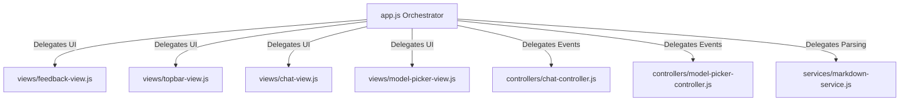

# Handoff Report: STONE-AUDIT-V3X Day 5-BE Frontend Migration

This document details the engineering state of the frontend decoupling and view-controller migration (Day 5-B through Day 5-E) on the `stone-audit-v3x-controlled-demolition` branch.

---

## 1. Branch & HEAD Status
- **Target Branch**: `stone-audit-v3x-controlled-demolition`
- **Current HEAD**: `19411382a5813221b39948b74da3099f8d28454a`
- **Git Push State**: Synchronized with remote origin.

---

## 2. Completed Migrations & Code Base Changes

The bloated legacy orchestrator in `src/interface/web/app.js` has been modularized into standard views, controllers, and services with robust fallbacks:



### Decoupled Components
1. **Day5-B: Utilities & Indicators**
   - [feedback-view.js](file:///f:/hajimi-code-cli/src/interface/web/views/feedback-view.js)
   - [markdown-service.js](file:///f:/hajimi-code-cli/src/interface/web/services/markdown-service.js)
   - [topbar-view.js](file:///f:/hajimi-code-cli/src/interface/web/views/topbar-view.js)
2. **Day5-C: Chat Turn Renderers**
   - [chat-view.js](file:///f:/hajimi-code-cli/src/interface/web/views/chat-view.js)
3. **Day5-D: Chat Controller Shell**
   - [chat-controller.js](file:///f:/hajimi-code-cli/src/interface/web/controllers/chat-controller.js)
4. **Day5-E: Model Picker**
   - [model-picker-view.js](file:///f:/hajimi-code-cli/src/interface/web/views/model-picker-view.js)
   - [model-picker-controller.js](file:///f:/hajimi-code-cli/src/interface/web/controllers/model-picker-controller.js)

---

## 3. Preserved Architectures (KEEP-FOR-NOW)
To prevent runtime disruptions and safeguard core engine mechanics, the following logics are strictly kept inside `app.js`:
- Core streaming execution loops: `streamChat()`, `handleAgentEvent()`, and `invokeAgentTask()`.
- Model provider CRUD operations: `saveProviderConfigs()`, `deleteProviderConfig()`, and OS Keyring key validations.

---

## 4. Quality Gate & Test Executions

### Running Checks
Ensure that all files satisfy Node.js syntax parsing:
```bash
node --check src/interface/web/app.js src/interface/web/views/*.js src/interface/web/controllers/*.js src/interface/web/services/*.js
```

### Running Target Smoke Tests
We have added 4 target smoke tests that simulate DOM actions in Node VM contexts:
- `tests/frontend/day31_feedback_markdown_topbar_smoke.js` (PASS)
- `tests/frontend/day32_chat_view_smoke.js` (PASS)
- `tests/frontend/day33_chat_controller_smoke.js` (PASS)
- `tests/frontend/day34_model_picker_smoke.js` (PASS)

### Running Regression Suite
Confirm that no existing functionalities are broken:
- `tests/frontend/day14_sessions_thinking_modules_smoke.js` (PASS)
- `tests/frontend/day16_slash_palette_smoke.js` (PASS)
- `tests/frontend/day19_settings_smoke.js` (PASS)
- `tests/frontend/day21_slash_palette_app_integration_smoke.js` (PASS)
- `tests/frontend/day27_handle_chat_command_invoke_smoke.js` (PASS)
- `tests/frontend/day29_session_list_dom_smoke.js` (PASS)

---

## 5. Active Technical Debts
- `DEBT-SECURITY-GATE-DAY5-BE-001`: `npm run test:security-gate` returns errors for legacy view scripts (`command-palette-view.js` and `session-list-view.js`). New files are 100% clean.
- `DEBT-WEBVIEW-DAY5-BE-001`: Visual validations on Tauri Webview were simulated via Node VM test rigs and are deferred for real-device checkouts.

---

## 6. Next Steps for Incoming Agent
1. Verify the current baseline using `git checkout stone-audit-v3x-controlled-demolition`.
2. Run target and regression smoke tests to confirm the development pipeline is clean.
3. Proceed to **Day 5-F** (Tauri WebView verification) or **Day 6 Sampling** based on the master roadmap in `docs/roadmap/Hajimi ToneFix/plan/new_plan.md`.
