# HAJIMI P0 Agent Governance Approval UI Remediation Roadmap

**文件路径**: `docs/roadmap/Hajimi AgentFix/plan/P0-AGENT-GOVERNANCE-UI-WAITING-REMEDIATION-ROADMAP.md`  
**生成日期**: 2026-06-01  
**关联债务**: `AD-011` / `DEBT-AGENT-GOVERNANCE-UI-WAITING`  
**目标**: 修复 Desktop packaged WebView 中 `/agent` 高风险工具审批 UI 不可达的问题。保持现有安全策略不降级，让 `write_file` / `append_file` 等高风险工具继续等待显式用户批准，同时让前端真正收到 `approval_request`、渲染审批 UI，并通过 `resolve_agent_approval` 回传批准或拒绝结果。  
**原则**: 最小改动、桥接修复优先、安全不降级、数据诚实、真实 WebView 验收。

---

## 当前结论

真实 WebView smoke 已确认：

```text
/agent 请在当前工作区根目录创建一个名为 agent-smoke-check.txt 的文件，内容写入 Agent smoke OK。
```

现象：

```text
后端正确进入 GovernanceWaiting
write_file 被识别为 Critical approval
后端等待 30 秒后安全拒绝
用户侧没有看到 approval popup / modal / sidebar prompt
目标文件没有创建
```

这说明：

```text
正确：
- write_file 仍是高风险工具
- 后端 governance gate 生效
- timeout 后拒绝是安全行为
- 未批准时文件不落盘

错误：
- approval_request 事件没有被 packaged WebView 中的前端 UI 接住
- 用户无法 approve / reject
```

一句话：**门锁是好的，门铃没响。不要拆门，修门铃。**

---

## 优先级

1. **P0 Frontend Event Bridge 修复**: `window.HajimiTauri.listen(eventName, handler)` 支持 Tauri event subscription。
2. **P0 Approval UI 可达性修复**: `setupGovernance()` 不再直接依赖 `window.__TAURI__.event.listen`，改用统一桥接层。
3. **P0 Approve / Reject 回传闭环**: modal 点击必须调用 `resolve_agent_approval`，payload 保持 request id 一致。
4. **P1 Frontend Smoke 覆盖**: Node smoke 覆盖 listener、modal render、approve、reject、missing listener diagnostic。
5. **P1 Real WebView Smoke & Debt Closure**: 真实 packaged app 验证 approve / reject 两条路径，并更新 debt 证据。

---

## 总原则

- 不设置 `withGlobalTauri = true` 作为修复手段。
- 不降低 `write_file` / `append_file` / `delete_file` 等工具风险等级。
- 不让高风险写工具默认 Auto-approved。
- 不修改 LLM-Native loop、DeepSeek provider、token budget、duplicate read-only guard。
- 不让 listener 安装失败静默发生；必须显示可见 diagnostic。
- 只在确认前端桥接无法满足时，才最小补后端 contract；不做大重构。
- 真实 WebView approve / reject 路径未通过前，不关闭债务。

---

## 路线规划图

```mermaid
flowchart TD
    A[P0 Debt Confirmed<br/>Real WebView write_file smoke failed<br/>GovernanceWaiting visible in Trace<br/>Approval UI not visible] --> B{Root Cause?<br/>Frontend event bridge mismatch}
    B -->|High Confidence| C[Phase 0: Baseline Sampling<br/>- Verify withGlobalTauri=false<br/>- Verify HajimiTauri bridge has invoke/Channel but no listen<br/>- Verify setupGovernance listener path<br/>- Verify resolve_agent_approval backend contract<br/>- Sample real packaged WebView event API before coding]
    C --> D[Phase 1: Bridge Repair<br/>- Add HajimiTauri.listen only after event API reachability is proven<br/>- Keep withGlobalTauri=false<br/>- Return unlisten function when possible<br/>- Stop if only guessed internals are available]
    D --> E[Phase 2: Governance UI Wiring<br/>- setupGovernance uses HajimiTauri.listen<br/>- Subscribe approval_request once<br/>- Render premium approval modal<br/>- Approve/Reject invokes resolve_agent_approval<br/>- Missing listener emits visible diagnostic]
    E --> F[Phase 3: Frontend Smoke<br/>- Stub HajimiTauri.listen<br/>- Fake approval_request payload<br/>- Assert .premium-approval-overlay visible<br/>- Click approve/reject<br/>- Assert resolve_agent_approval payload]
    F --> G[Phase 4: Desktop Smoke<br/>- cargo check hajimi-desktop<br/>- packaged WebView write_file prompt<br/>- Reject path leaves no file<br/>- Approve path creates exact file<br/>- Trace shows GovernanceApproved -> ToolExecutionSuccess]
    G --> H[Closure<br/>- Update debt status<br/>- Record command outputs + screenshots/logs<br/>- Keep security posture unchanged]
    style A fill:#ff4444,color:#fff
    style H fill:#44cc66,color:#000
```



---

## 详细执行步骤

### Step 0: Baseline Sampling & Contract Confirmation

**目标**: 不改代码前先确认 event bridge 断点，避免修错层。

检查项：

```bash
git branch --show-current
git rev-parse HEAD
rg -n "withGlobalTauri" src/interface/desktop/tauri.conf.json
rg -n "HajimiTauri|__TAURI__|listen|Channel|invoke" src/interface/web/modules/tauri-bridge.js src/interface/web/app.js
rg -n "approval_request|resolve_agent_approval|pending_approvals|UiBridgeGovernance" src/interface/desktop/src/main.rs src/interface/web/app.js
```

真实 WebView 采样项：

```text
在 packaged desktop WebView 中确认 window 可见对象，不允许只按名字猜。
必须记录这些对象是否存在：
- window.HajimiTauri
- window.__TAURI__
- window.__TAURI__?.event?.listen
- window.__TAURI_INTERNALS__
- window.__TAURI_INTERNALS__ 中是否存在真实 event/listen 能力

若无法打开 DevTools 或无法直接采样 window keys，则必须把该事实写入债务/执行记录，
并把 Day 1 的目标降级为“补可见 diagnostic + 评估 polling fallback”，不能硬编 API。
```

预期：

```text
- tauri.conf.json 中 withGlobalTauri=false
- tauri-bridge.js 暴露 invoke / isAvailable / Channel
- tauri-bridge.js 当前缺少 listen
- app.js 的 approval_request listener 若直接使用 window.__TAURI__.event.listen，则为根因路径
- backend 应存在 resolve_agent_approval command；若缺失，作为 contract bug 进入 Step 2 最小补齐
- 必须有真实 evidence 证明所选底层 event API 在 packaged WebView 中存在；否则不得进入直接桥接实现
```

验收：

```text
[PASS] 根因链路被命令输出确认
[PASS] 未改动任何生产文件
[PASS] 若 backend command 缺失，记录为 CONTRACT-GAP，不直接扩大修复范围
```

---

### Step 1: Extend `HajimiTauri` Event Bridge

**目标文件**:

```text
src/interface/web/modules/tauri-bridge.js
```

新增能力：

```js
HajimiTauri.listen(eventName, handler)
```

设计要求：

```text
- 优先复用当前 packaged WebView 已采样确认可用的 Tauri event API
- dev 环境可兼容 window.__TAURI__.event.listen
- handler 接收统一 payload：event.payload ?? event
- 返回 unlisten function；如果底层返回 Promise<unlisten>，调用方可 await
- listen 不可用时抛出明确错误：Tauri event listen unavailable
- 不允许为了让该 wrapper 成立而臆造 `__TAURI_INTERNALS__.listen`、`__TAURI_INTERNALS__.event.listen` 等未被采样证实的 API
```

建议实现形态：

```js
function getGlobalEventListen() {
  const tauri = global.__TAURI__;
  return tauri?.event?.listen || null;
}

function getInternalEventListen() {
  const internals = global.__TAURI_INTERNALS__;
  // Only use keys confirmed by real WebView sampling.
  return internals?.event?.listen || internals?.listen || null;
}

async function listen(eventName, handler) {
  const rawListen = getGlobalEventListen() || getInternalEventListen();
  if (!rawListen) {
    throw new Error('Tauri event listen unavailable');
  }
  return rawListen(eventName, handler);
}
```

> 注：实际实现需以当前 Tauri v2 packaged 环境可用对象为准。若 `__TAURI_INTERNALS__` 无 event API，则 Codex 必须采样真实 window keys 或采用现有项目可用桥接方式，不得硬编不存在 API。若采样仍无法找到事件监听入口，停止本路线，转入 `pending approvals polling command` 备选方案设计。

验证命令：

```bash
node --check src/interface/web/modules/tauri-bridge.js
rg -n "listen\\(|HajimiTauri" src/interface/web/modules/tauri-bridge.js
```

---

### Step 2: Rewire `setupGovernance()` to Bridge

**目标文件**:

```text
src/interface/web/app.js
```

核心改动：

```text
旧：window.__TAURI__.event.listen('approval_request', ...)
新：window.HajimiTauri.listen('approval_request', ...)
```

必须满足：

```text
- setupGovernance 幂等：重复 init 不重复注册 listener
- listener install success 后记录状态，如 this._governanceListenerInstalled = true
- listener install failure 显示 toast/trace diagnostic，不可静默
- approval_request payload 兼容 request_id / requestId
- modal 必须包含 action_type、description、risk_score、Approve、Reject
- Approve 调用 resolve_agent_approval approved=true
- Reject 调用 resolve_agent_approval approved=false
- 成功响应后关闭 modal
- invoke 失败时显示错误，不直接假装成功
```

建议状态字段：

```js
_governanceListenerInstalled: false,
_governanceUnlisten: null,
_pendingApprovalModal: null,
```

建议诊断文案：

```text
Approval UI unavailable: cannot subscribe to approval_request events.
```

验证命令：

```bash
node --check src/interface/web/app.js
rg -n "setupGovernance|approval_request|resolve_agent_approval|premium-approval-overlay|HajimiTauri.listen" src/interface/web/app.js
```

---

### Step 3: Frontend Smoke Coverage

**新增文件**:

```text
tests/frontend/agent_governance_approval_smoke.js
```

必须覆盖：

```text
1. window.HajimiTauri.listen 可用时，setupGovernance 订阅 approval_request 一次。
2. fake approval_request payload 触发后，document.body 出现 .premium-approval-overlay。
3. 点击 Approve 后，invoke('resolve_agent_approval', { requestId, approved: true })。
4. 点击 Reject 后，invoke('resolve_agent_approval', { requestId, approved: false })。
5. listen 缺失 / 抛错时，出现 visible diagnostic，不再静默失败。
```

建议 payload：

```json
{
  "request_id": "approval-test-001",
  "action_type": "write_file",
  "description": "LLM-Native turn execution of tool 'write_file' with arguments: {\"path\":\"agent-smoke-check.txt\"}",
  "risk_score": 0.95,
  "level": "Critical"
}
```

验证命令：

```bash
node tests/frontend/agent_governance_approval_smoke.js
```

---

### Step 4: Backend Contract Verification

**目标文件**:

```text
src/interface/desktop/src/main.rs
```

只在发现 contract 缺口时修改。

必须确认：

```text
- backend emits approval_request
- approval payload 包含 request_id / action_type / description / risk_score / level
- resolve_agent_approval command 存在
- resolve_agent_approval 从 pending_approvals 移除对应 request_id 并发送 bool
- timeout 仍保留 30 秒安全拒绝
```

如果 `resolve_agent_approval` 不存在，则最小新增：

```rust
#[tauri::command]
async fn resolve_agent_approval(
    request_id: String,
    approved: bool,
    state: tauri::State<'_, AppState>,
) -> Result<(), String> {
    let mut map = state.pending_approvals.lock().await;
    let tx = map.remove(&request_id).ok_or_else(|| {
        format!("No pending approval found for request_id '{}'", request_id)
    })?;
    tx.send(approved).map_err(|_| "Approval receiver dropped".to_string())
}
```

注意：

```text
- 不改变 approve timeout
- 不改变 high-risk tool policy
- 不把 approval 逻辑塞进 Intelligence 层
```

验证命令：

```bash
cargo check -p hajimi-desktop
rg -n "approval_request|resolve_agent_approval|pending_approvals" src/interface/desktop/src/main.rs
```

---

### Step 5: Real WebView Smoke & Closure

真实 smoke prompt：

```text
/agent 请在当前工作区根目录创建一个名为 agent-smoke-check.txt 的文件，内容写入 Agent smoke OK。
```

Reject 路径：

```text
[PASS] approval modal appears
[PASS] user clicks Reject
[PASS] file does not exist
[PASS] agent reports user rejection / permission denied
[PASS] trace shows GovernanceWaiting -> GovernanceRejected
```

Approve 路径：

```text
[PASS] approval modal appears
[PASS] user clicks Approve
[PASS] agent-smoke-check.txt is created
[PASS] file content exactly equals: Agent smoke OK
[PASS] trace shows GovernanceWaiting -> GovernanceApproved -> ToolExecutionSuccess
[PASS] smoke file removed after test
```

最终命令：

```bash
node --check src/interface/web/modules/tauri-bridge.js
node --check src/interface/web/app.js
node tests/frontend/agent_governance_approval_smoke.js
cargo check -p hajimi-desktop
```

可选打包：

```bash
cd src/interface/desktop
cargo tauri build
```

---

## 预期成果

- `approval_request` 在 packaged WebView 中能被前端接收。
- 高风险工具调用时用户能看到明确 approve/reject UI。
- Reject 不创建文件，且后端安全失败。
- Approve 创建文件，Agent loop 继续执行。
- 不需要开启 `withGlobalTauri`。
- 不削弱 write 工具安全策略。
- 新增 smoke 防止回归。

---

## 风险 & 回滚

| 风险 | 说明 | 处理 |
|---|---|---|
| Tauri event API 在 packaged 环境不可从当前 bridge 访问 | `HajimiTauri.listen` 找不到可用底层 API | 停止，不开启 withGlobalTauri；采样 window keys 或改为后端 command polling 备选方案 |
| `resolve_agent_approval` payload 命名不一致 | 前端传 `requestId`，后端收 `request_id` 或反之 | 在前端 normalize，并在 Node smoke 覆盖 |
| modal 只在 dev 可见，packaged 不可见 | dist 同步或 bundle 未更新 | 跑 `sync-web-dist` / package smoke，记录 build sha |
| approve 后写文件仍失败 | 可能是 workspace path 或 tool args 问题 | 另开 tool execution debt，不改 approval bridge |
| reject 后仍写文件 | 安全 P0，立即回滚并停止 |

回滚方式：

```bash
git restore -- src/interface/web/modules/tauri-bridge.js src/interface/web/app.js tests/frontend/agent_governance_approval_smoke.js
```

若涉及后端 contract：

```bash
git restore -- src/interface/desktop/src/main.rs
```

---

## 最终关闭条件

```text
[ ] Frontend smoke: listener / modal / approve / reject / missing-listener diagnostic 全部通过
[ ] cargo check -p hajimi-desktop 通过
[ ] packaged WebView Reject 路径通过，文件不创建
[ ] packaged WebView Approve 路径通过，文件创建且内容正确
[ ] Trace 中可见 GovernanceWaiting -> GovernanceApproved/Rejected
[ ] debt 文档更新为 FIXED-CANDIDATE / NEEDS-RECHECK
```

---

*本 Roadmap 聚焦 AD-011 / DEBT-AGENT-GOVERNANCE-UI-WAITING。它不是 LLM-Native loop 修复，不是 DeepSeek schema 修复，不是 token budget 修复。当前唯一目标是让高风险工具审批 UI 在真实 Desktop WebView 中可达。*
