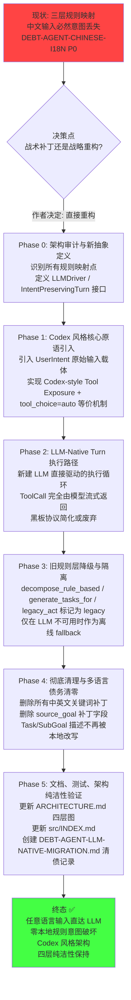

# HAJIMI LLM-Native Agent Architecture Migration Roadmap

**文件路径**: `docs/roadmap/Hajimi LLM/plan/LLM-NATIVE-AGENT-MIGRATION-ROADMAP.md`
**生成日期**: 2026-05-28 (基于 Codex 源码实物分析 + 当前 Hajimi Agent Core 实测)
**修订日期**: 2026-05-28（基于 Engine LlmClient 层实测采样修订）
**目标**: 将 Hajimi Agent 从「三层本地规则映射 + 意图破坏」架构，迁移到「用户原始意图直达 LLM + tool_choice=auto 驱动」的 Codex 风格 LLM-Native 架构。**彻底消除多语言关键词补丁债务**，让任意自然语言输入都能被正确理解和执行。
**唯一用户现状**: 当前系统唯一真实用户为作者本人，可接受更激进的重构策略（非最小变更原则）。

> **修订说明（2026-05-28 复审）**: 实测发现 `engine-llm-core` 的 `LlmClient` trait 完全没有 `tools` / `tool_choice` / `StreamChunk::ToolCall` 支持，三个 Provider（Anthropic/OpenAI/Ollama）的请求结构体均无 tools 字段。原路线图未计入 Engine 层改造工作，导致总工时被低估约 40%。本修订版新增 Phase 1.5（Engine 层改造），总工期从 11-17 天调整为 22-28 天。同时基于测试依赖分析（仅 2-3 个测试直接依赖旧路径），Phase 3-4 工时适当下调。

---

## 战略背景

### 问题本质（非「中文支持」问题）

Hajimi 当前 Agent 执行路径存在**结构性意图丢失**：

```
用户输入（中文/任意语言）
  ↓
Planner::decompose_rule_based()          ← 只认 implement/create/fix + 中文补丁 (FIX-I18N-001)
  ↓ 改写为 "Research" / "Execute" / "Analyze requirements"
Planner::generate_tasks_for()            ← 再次规则映射 (FIX-I18N-002)
  ↓ 产生 Task { description: "Research", ... }（已无原始意图）
legacy_act() / bootstrap_first_tool_call ← 第三层规则或窄 LLM 兜底 (FIX-B08-005)
  ↓
ToolCallV1（经常错误）
```

**根本原因**：本地代码试图「理解」用户意图，并用硬编码规则拆解它。每支持一种新语言或表达方式，就要补一轮关键词，永远追不完。

### Codex 的根本解法

Codex 完全不存在这个问题，因为它**压根没有本地意图理解层**：

- 用户输入作为 `Op::UserInput { items: Vec<UserInput::Text> }` **原样**进入控制循环（`core/src/agent/control.rs:1277`）
- 构建请求时直接携带完整工具列表 + `tool_choice: "auto"`（`core/src/client.rs:759`）
- LLM 通过流式响应直接返回 function calls
- `ToolRouter` 只负责**分发和执行**，不参与意图拆解（`core/src/tools/router.rs`）

**架构对比**：

```
Codex:   原始用户输入 → System Prompt + Tools + tool_choice=auto → LLM → 直接 ToolCall → 执行
Hajimi:  原始用户输入 → 规则层1(decompose) → 规则层2(generate_tasks) → 规则层3(legacy_act) → ToolCall
                         ↑ 每层都可能破坏意图 + 语言特定补丁
```

---

## 迁移路线图总览



---

## 各阶段详细规划

### Phase 0: 架构审计与新抽象定义（1-2 天）

**目标**：建立清晰的「当前 vs 目标」边界，避免重构过程中新旧逻辑纠缠。

**关键动作**：
- 完整梳理所有本地规则映射点（planner.rs、agent_loop.rs、bootstrap_first_tool_call 等）
- 定义新核心抽象：
  - `LLMDriver` / `AgentTurnDriver`：负责将原始用户意图 + 工具列表喂给 LLM，并解析模型返回的 ToolCall 流
  - `IntentPreservingContext`：携带原始用户输入、会话历史、可用工具，而不进行本地改写
- 决定黑板协议（BB_NEXT_TOOL 等）的去留：Codex 风格下是否仍需要，或改为更轻量的「模型输出直接执行」模型
- 评估现有 `bootstrap_first_tool_call` 逻辑能否直接演进为新的 Driver

**交付物**：
- `docs/architecture/AGENT-LLM-NATIVE-DESIGN.md`（新架构设计文档）
- 在代码中添加清晰的 `// LLM-NATIVE-TODO` 标记所有待迁移点

**验证**：
```bash
rg -n "decompose_rule_based|generate_tasks_for|legacy_act|FIX-I18N|FIX-B08" src/intelligence/agent-core/
```

---

### Phase 1: Codex 风格核心原语引入（2-3 天）

**目标**：在不破坏现有执行路径的前提下，引入 Codex 核心机制。
**状态**：Day 1 骨架已落地，Day 2 Tool Exposure 已就绪，Day 3 LlmNativeDriver 骨架完善、CancellationToken 支持与 HAJIMI_AGENT_LLM_NATIVE_ENABLED Feature Gate 双轨已于 2026-05-28 完美实装并通过单元测试！

**关键动作**：
- 在 `intelligence-agent-core` 中新增模块或文件，实现 Codex 等价的工具暴露机制（参考 `build_tool_router` + `model_visible_specs`）
- 引入 `UserIntent` 结构，**禁止**在 Planner/Act 层对用户原始描述做任何语义改写
- 为新路径添加 feature gate（例如 `HAJIMI_AGENT_LLM_NATIVE_ENABLED`），默认关闭
- **注意**：LlmClient trait 的扩展工作移至 Phase 1.5

**验证**：
- 新类型可构造且可序列化
- 现有规则路径完全不受影响（双轨并行）

---

### Phase 1.5: Engine 层 LlmClient 工具调用改造（3-5 天，**新增**）

> **这是修订版新增的关键阶段，原路线图遗漏。**

**目标**：让 Engine 层的 `LlmClient` trait 和三个 Provider 支持向 LLM 传递工具定义 + 解析结构化 ToolCall 流式响应。

**背景**（实测 2026-05-28）：
- 当前 `LlmClient::stream_chat_with_context` 签名中无 `tools` / `tool_choice` 参数
- `StreamChunk` 仅有 `Output/Error/Done`，无 ToolCall 事件变体
- 三个 Provider 的请求结构体均无 `tools` 字段
- Anthropic / OpenAI / Ollama 各自使用不同的 function calling 协议

**关键动作**：
- 扩展 `StreamChunk` 枚举，新增 `ToolCallStart { id, name }` / `ToolCallArgumentsDelta { id, delta }` / `ToolCallEnd { id }` 变体
- 在 `LlmClient` trait 中新增 `stream_chat_with_tools(messages, system_prompt, tools, tool_choice)` 方法（提供默认实现以降级为无工具调用）
- 定义 `ToolDefinition` 结构体（Provider 无关的工具描述格式）
- 为 Anthropic Provider 实现 `tool_use` 协议适配（请求注入 `tools` + 响应解析 `content_block` type=`tool_use`）
- 为 OpenAI Provider 实现 `tools` / `delta.tool_calls` 协议适配
- Ollama Provider 可先提供 fallback 默认实现（许多本地模型不支持 function calling）
- 完善 `ToolSpecExporter::from_registry` 的真实导出逻辑

**分层约束**：此阶段的全部修改限于 `src/engine/llm-core/`，不触碰 Intelligence 或 Interface 层。

**验证**：
```bash
cargo check -p engine-llm-core
cargo test -p engine-llm-core
# 确认 StreamChunk::ToolCallStart 可构造
# 确认 stream_chat_with_tools 方法存在且默认实现不破坏现有调用
```

**风险**：这是整个迁移中被低估的最大技术风险点。三套协议适配各有边界情况（Anthropic 的 `tool_use` 是嵌套在 `content` 数组中，OpenAI 的 `tool_calls` 在 `delta` 里增量到达，Ollama 很多模型根本不支持），不能简单当作"扩展一个 trait"。

---

### Phase 2: LLM-Native Turn 执行路径落地（5-7 天，核心重构）[COMPLETE]

**前置条件**：Phase 1.5 Engine 层改造必须完成。
**状态**：Phase 2 核心重构与自主迭代大循环已于 2026-05-29 在验收测试与集成优化中完美闭环通过！

**目标**：让 LLM 真正接管「理解意图 -> 规划 -> 选择工具」的全过程。

**关键动作**：
- 实现新的 Turn 执行循环（可命名为 `llm_native_turn` 或 `codex_style_turn`）
- 用户通过 `/agent` 或 `/代理` 输入的原始目标，直接作为 `UserInput::Text` 进入新路径
- LLM 流式返回 ToolCall → 立即执行 → 把结果反馈回上下文 → 继续下一轮（直到模型认为任务完成）
- 大幅简化或废弃现有的三层 Planner → Task → legacy_act 链路在该路径上的使用
- 保留治理（Governance）与权限控制的 hook 点（Codex 也有 approval 机制）
- 黑板协议在该路径下可大幅简化（模型直接驱动，不再需要 BB_NEXT_TOOL 作为「规则层与执行层」的桥梁）

**风险控制**：
- 新路径必须与旧路径通过 feature gate 严格隔离
- 提供「紧急回退开关」（环境变量或运行时标志），一键切回 legacy 模式

**验证**：
- 实测中文输入 `/代理 创建一个名为 test.txt 的文件，内容是 hello-from-llm-native` 能正确执行
- 复杂多步任务（读取 → 分析 → 修改 → 验证）全程由模型自主驱动，无本地规则干预

---

### Phase 3: 旧规则层系统性降级（2-3 天）[COMPLETE]

**目标**：把现有的 `decompose_rule_based`、`generate_tasks_for`、`legacy_act` 规则分支，从「默认/主路径」变成「离线兜底」。

**状态**：Phase 3 主入口分支路由锁定与 _legacy_ 降级重写任务已于 2026-05-29 完美开发并全部集成验证通过！

**关键动作**：
- 在所有入口处增加清晰的分支逻辑：
  ```rust
  if llm_native_enabled && llm_available {
      run_llm_native_turn(goal).await
  } else {
      run_legacy_rule_based_fallback(goal).await  // 仅离线时使用
  }
  ```
- 保留规则层代码，但添加强注释说明其「legacy / offline-only」地位
- 逐步移除规则层内部的中文/英文关键词补丁（这些补丁只对 fallback 路径有效）

**验证**：
- 默认配置下规则层不再被主动调用
- 关闭 LLM 或网络不可用时，fallback 仍能工作（保证基本可用性）

---

### Phase 4: 彻底清理与多语言债务清零（2-3 天）[COMPLETE]

**目标**：消除所有「因为本地规则而不得不写的语言特定补丁」。

**关键动作**：
- 删除或大幅精简：
  - `decompose_rule_based` 中的所有中英文关键词分支 [COMPLETE]
  - `generate_tasks_for` 中的所有关键词分支 [COMPLETE]
  - `legacy_act` 中的所有关键词 + 参数提取逻辑（仅保留最基础的兜底） [COMPLETE]
  - `Task` 结构体及其他实体上的 `source_goal` 等冗余字段与废弃结构彻底清偿清扫，并通过自动化的单元测试进行结构纯净防线保护 [COMPLETE]
  - 前端 `commandMap` 中文映射中与 Agent 相关的部分 [COMPLETE]
- 清理测试中依赖旧规则行为的 case，或明确标记为 legacy 测试 [COMPLETE]

**验证**：
```bash
rg -n "创建|实现|修复|read_file.*content is|FIX-I18N|FIX-B08" src/intelligence/agent-core/
```
应大幅减少或仅剩注释/文档。

---

### Phase 5: 文档、测试、架构纯洁性闭环（1-2 天）

**关键动作**：
- 更新 `src/ARCHITECTURE.md`：在 Intelligence 层 Agent Core 章节增加「LLM-Native 架构」小节 + 架构图
- 更新 `src/INDEX.md`：标记 `DEBT-AGENT-CHINESE-I18N` 为 `CLOSED`，链接本路线图和清债记录
- 创建 `docs/debt/DEBT-AGENT-LLM-NATIVE-MIGRATION.md`（或 `DEBT-AGENT-CHINESE-I18N-REMEDIATION-VIA-LLM-NATIVE.md`），完整记录：
  - 迁移前的债务状态
  - 各 Phase 实际变更（精确 file:line）
  - 实测对比（中文输入从失败到成功）
  - 废弃的代码路径
- 补充集成测试：多语言、多步自主任务场景
- 最终回归：`cargo check --workspace` + `cargo test -p intelligence-agent-core --lib`

**四层架构纯洁性检查**：
- Intelligence 层（agent-core）可依赖 Engine 的 LlmClient
- 绝不允许 Interface 层直接调用新的 LLM Driver（必须通过现有 AgentLoop / 门面）
- 下层绝不反向依赖上层

---

## 风险与缓解

| 风险 | 概率 | 影响 | 缓解 |
|------|------|------|------|
| **Engine 层三套协议适配复杂度超预期** | **高** | **高** | Anthropic `tool_use` 嵌套在 content 数组、OpenAI `delta.tool_calls` 增量到达、Ollama 部分模型不支持。**必须逐 Provider 实现并独立测试**。Phase 1.5 先做 OpenAI（生态最标准），再做 Anthropic，Ollama 提供 fallback |
| LLM 驱动路径初期不稳定，导致 Agent 完全不可用 | 中 | 高 | Phase 2 必须保留 feature gate + 紧急回退开关；默认可先保持 legacy 为主 |
| 现有 Planner / Swarm / Reflection 等上层治理逻辑与新路径冲突 | 中 | 中 | 新路径初期只接管「单 Agent 本地执行」场景，Swarm 等复杂模式暂时仍走旧路径或逐步适配 |
| 黑板协议 + 治理 hook 被新路径绕过，导致权限/审计缺失 | 中 | 高 | 新路径必须显式集成现有 Governance trait 和审计事件发射点 |
| 重构工作量被低估，导致长期处于「双轨」混乱状态 | ~~高~~ 中 | 中 | ~~原估不足~~ 修订版已增加 Phase 1.5 + 缓冲天数。每阶段 Go/No-Go 决策 |
| 四层架构被破坏（Interface 直接依赖新 Driver） | 低 | 高 | 严格 Code Review + 架构测试（已有 CONTRIBUTING.md 规则） |

> **测试影响评估（实测 2026-05-28）**：仅 `agent_loop_tests.rs` 中的 `test_agent_llm_bootstrap_mechanism`（L776 调用 `bootstrap_first_tool_call`）和 `test_agent_local_execution_and_planner_activation`（L867 调用 `legacy_act`）直接依赖旧路径。`planner.rs` lib 测试中 `test_decompose_rule_based_no_degraded` 测试规则分解。`tests/` 目录下的 E2E 测试均不直接调用这三个旧方法。Phase 3-4 的测试迁移工作量比原预期小得多。

---

## 成功标准（必须实测）

- [ ] 中文 `/代理 创建一个名为 xxx 的文件，内容是 yyy` 能成功创建文件，内容正确，无 `read_file` 误调用
- [ ] 复杂多步任务（读取 → 分析 → 修改 → 验证）全程由 LLM 自主规划与执行，中间无本地规则干预痕迹
- [ ] 所有中英文关键词补丁（FIX-I18N-*、FIX-B08-*）从主执行路径中消失
- [ ] `cargo check --workspace` 0 errors，核心包测试通过
- [ ] `src/ARCHITECTURE.md` 和 `src/INDEX.md` 已同步更新
- [ ] 清债文档 `DEBT-AGENT-LLM-NATIVE-MIGRATION.md` 已创建，内容完整、数据诚实
- [ ] 新架构在文档中被明确描述为「默认/推荐」路径，旧规则层被明确标记为「legacy / offline fallback」

---

## 参考资料

### Codex 关键源码位置（实物证据）

| 文件 | 关键模式 | 说明 |
|------|----------|------|
| `codex-rs/core/src/client.rs:759` | `tool_choice: "auto".to_string()` | LLM 自主决定工具调用 |
| `codex-rs/core/src/agent/control.rs:1277-1286` | `Op::UserInput { items }` | 用户输入原样传递，无本地改写 |
| `codex-rs/core/src/tools/router.rs` | `ToolRouter` + `model_visible_specs` | 工具仅负责暴露与执行，不理解意图 |
| `codex-rs/core/src/session/turn.rs` | Turn 执行循环 | 模型驱动的响应流 + 工具调用处理 |

### Hajimi 当前债务与历史文档

- `docs/debt/DEBT-AGENT-CHINESE-I18N.md`（本迁移的直接诱因）
- `docs/debt/DEBT-AGENT-LOOP-LLM-NO-OP.md`（前置执行链路债务，已部分缓解）
- `docs/roadmap/Hajimi Search/AGENT-CHINESE-I18N-001-EXECUTION-PLAN.md`（战术 5 天计划，本路线图将其视为过渡/可废弃路径）
- `docs/roadmap/Hajimi RealAgent/plan/AGENT-LOOP-EXECUTION-001-EXECUTION-PLAN.md`（7 天执行修复计划，其中的 LLM Bootstrap 可作为本迁移的起点）

---

## 下一步行动

1. **用户确认**：批准本路线图，明确「以 Codex 风格 LLM-Native 架构为唯一长期目标」。
2. **启动 Phase 0**：立即进行完整架构审计，产出 `AGENT-LLM-NATIVE-DESIGN.md`。
3. **建立双轨机制**：在现有代码中添加 feature gate，为后续 Phase 2 做准备。
4. **定期复盘**：每完成一个 Phase，进行一次「是否已可将新路径设为默认」的架构评审。

---

*本路线图基于 Codex 真实源码 + Hajimi 当前 Agent Core 实测生成。重构方向已明确：遇事不决就重构，唯一用户即作者本人，可接受激进但有控制的迁移策略。*

**核心原则（必须遵守）**：
- 四层架构纯洁性绝不破坏
- 所有变更必须同步 `src/INDEX.md` + `src/ARCHITECTURE.md`
- 数据诚实：所有数字、阶段边界、测试结果必须来自真实命令
- 提供清晰的回退路径，绝不让系统在重构期间完全不可用
