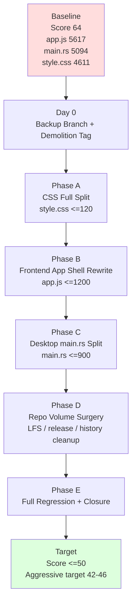

结论：**既然允许破坏性重构，那就别再“修边角”了，直接开 `V3X Controlled Demolition`：把 `app.js / style.css / main.rs` 三座主山拆成可维护结构，顺手处理仓库体积。**

当前老评分是 **64/100**，属于 51-70 的“中度/中重度史山”；要打到 51 以下，继续补 DOM smoke 小票不够，必须动主结构。
V2 全量扫描已经把主战场钉死：`app.js` 5617 行、`main.rs` 5094 行、`style.css` 4611 行；另外 git pack 有 3.81 GiB、`target` / models / 历史大对象也在拖后腿。
我下面按你给的 ROADMAP 模板那种“优先级 → 路线图 → 执行步骤 → 预期成果 → 风险回滚”，以及 Daily Plan 模板那种“每日任务 + 文件 + 验收命令”来写。 

---

# 先回答三个核心问题

## 1. 拆什么文件

第一阶段直接拆这 4 类：

| 优先级 | 文件 / 区域                             | 当前问题                           | 激进目标                                                 |
| --- | ----------------------------------- | ------------------------------ | ---------------------------------------------------- |
| P0  | `src/interface/web/app.js`          | 5617 行，前端万能总控                  | 压到 **≤1200 行**，只保留 bootstrap / app shell             |
| P0  | `src/interface/web/style.css`       | 4611 行，全局样式大锅                  | 压到 **≤120 行**，只保留 imports                            |
| P0  | `src/interface/desktop/src/main.rs` | 5094 行，Tauri 后端总控              | 压到 **≤900 行**，只保留 builder / registry                 |
| P1  | repo 体积：`target` / models / 历史大对象   | git pack 3.81 GiB，clone/CI 负担大 | 做 LFS / release asset / history rewrite 方案，允许执行破坏性清理 |

不再把 `V2G-1 sessionList WebView smoke` 作为下一刀。那个是补小票，现在我们进爆破模式。

## 2. 怎么拆

一句话：

```text
按领域拆，不按函数散拆；直接建立新结构，把旧巨石削成入口壳。
```

### `app.js` 拆成这些

```text
src/interface/web/app/
  bootstrap.js
  app-state.js
  app-shell.js
  event-bus.js

src/interface/web/controllers/
  chat-controller.js
  command-controller.js
  provider-controller.js
  settings-controller.js
  session-controller.js
  inspector-controller.js
  model-picker-controller.js
  workspace-controller.js

src/interface/web/services/
  tauri-service.js
  storage-service.js
  provider-service.js
  chat-service.js

src/interface/web/views/
  chat-view.js
  command-palette-view.js
  session-list-view.js
  settings-view.js
  inspector-view.js
  model-picker-view.js
  topbar-view.js
```

`app.js` 最后只干三件事：

```text
1. 创建 app state
2. 注册 controllers/views/services
3. 挂 window.app 兼容壳
```

人话：**原来 app.js 是“老板 + 厨师 + 收银 + 保安 + 洗碗工”，现在只让它当店长，别让它亲自炒 200 道菜。**

### `style.css` 拆成这些

```text
src/interface/web/styles/
  tokens.css
  base.css
  layout.css
  sidebar.css
  topbar.css
  chat.css
  command-palette.css
  slash-palette.css
  sessions.css
  settings.css
  provider.css
  model-picker.css
  inspector.css
  dashboard.css
  modals.css
  utilities.css
```

`style.css` 最后只保留：

```css
@import "./styles/tokens.css";
@import "./styles/base.css";
@import "./styles/layout.css";
...
```

### `main.rs` 拆成这些

```text
src/interface/desktop/src/
  main.rs
  state.rs
  registry.rs
  startup.rs
  error.rs

src/interface/desktop/src/commands/
  mod.rs
  chat.rs
  provider.rs
  checkpoint.rs
  shell.rs
  fs.rs
  git.rs
  dashboard.rs
  audit.rs
  governance.rs
  mcp.rs
  context.rs
```

`main.rs` 最后只保留：

```text
1. mod 声明
2. AppState 初始化
3. tauri::Builder
4. command registry 挂载
5. run()
```

## 3. 拆到什么程度才不算史山

第一阶段“不算史山”不是 0 债务，而是从“中重度史山”降到“有债务但可治理”。

硬门槛：

```text
app.js <= 1200 行
style.css <= 120 行
main.rs <= 900 行
任一 src/interface 手写单文件 <= 1500 行
任一新增模块 <= 800 行
任一函数目标 <= 150 行，超过必须有解释
Provider/Shell/Checkpoint/Agent streaming 可被拆文件，但必须保留边界文档和回滚点
git pack 体积必须有清理方案；若执行历史清理，目标 < 1 GiB
MasterMind v0.7 更新，记录 before/after
```

评分目标：

```text
当前：64
保守目标：<=50
激进目标：42~46
```

---

# ROADMAP：STONE-AUDIT-V3X-CONTROLLED-DEMOLITION

## 0. 项目目标

```text
目标：用破坏性但可回滚的结构重组，把 Hajimi Code CLI 从“中重度史山”压到“可治理债务区”。

核心动作：
1. app.js 巨石拆成 app/controllers/services/views
2. style.css 巨石拆成 styles/*
3. main.rs 巨石拆成 state/registry/commands/*
4. repo 体积做清理，允许 LFS / release asset / history rewrite
5. 更新 MasterMind v0.7，记录 before/after
```

## 1. 优先级

| 优先级 | 模块            | 动作                                      | 结果                 |
| --- | ------------- | --------------------------------------- | ------------------ |
| P0  | Frontend App  | 重建 `app/ controllers/ services/ views/` | `app.js <= 1200`   |
| P0  | CSS           | 无构建 CSS 模块化                             | `style.css <= 120` |
| P0  | Desktop Tauri | `main.rs` command 分域拆分                  | `main.rs <= 900`   |
| P1  | Repo Volume   | LFS / release asset / history rewrite   | pack 目标 `<1 GiB`   |
| P1  | Regression    | Node + Cargo + WebView 总回归              | 不白屏、不崩、不误碰高风险      |
| P2  | Docs          | MasterMind v0.7 + closure               | 接手者不用读聊天记录         |

---

## 2. 路线图



---

## 3. Phase A：CSS 爆破拆分

### 目标

```text
style.css 从 4611 行变成 <=120 行 imports 壳。
```

### 主要动作

```text
1. 新建 styles/*
2. 按 UI 区域搬迁 CSS
3. 删除 style.css 中旧内容
4. 保留 import 顺序
5. 跑 WebView 视觉 smoke
```

### 输出文件

```text
src/interface/web/style.css
src/interface/web/styles/*.css
docs/frontend/CSS-SPLIT-V3X.md
```

### 验收

```text
style.css <=120 行
styles/*.css 单文件 <=1000 行
Command Palette / Session List / Settings / Inspector 可见
无白屏 / 无崩溃
```

---

## 4. Phase B：app.js 控制器化重构

### 目标

```text
app.js 从 5617 行降到 <=1200 行。
```

### 拆分方向

| 旧职责             | 新位置                                                                   |
| --------------- | --------------------------------------------------------------------- |
| 全局状态            | `app/app-state.js`                                                    |
| 初始化             | `app/bootstrap.js`                                                    |
| Chat            | `controllers/chat-controller.js` + `views/chat-view.js`               |
| Command Palette | `controllers/command-controller.js` + `views/command-palette-view.js` |
| Sessions        | `controllers/session-controller.js` + `views/session-list-view.js`    |
| Settings        | `controllers/settings-controller.js` + `views/settings-view.js`       |
| Provider        | `controllers/provider-controller.js` + `services/provider-service.js` |
| Tauri invoke    | `services/tauri-service.js`                                           |
| Storage         | `services/storage-service.js`                                         |
| UI feedback     | `views/topbar-view.js` / `ui-feedback.js`                             |

### 允许破坏

```text
允许临时破坏 window.app 内部结构
允许重命名内部 helper
允许删除旧 wrapper
允许批量移动函数
允许更新 smoke 适配新模块
```

### 不允许破坏

```text
不得泄露 API Key
不得放宽 Shell 白名单
不得把 CSP 改松
不得绕过 Provider/Keyring 安全边界
不得删除 checkpoint 数据行为
```

注意：**允许破坏结构，不等于允许拆掉保险丝。**

---

## 5. Phase C：main.rs 拆命令域

### 目标

```text
main.rs 从 5094 行降到 <=900 行。
```

### 拆分结构

```text
commands/
  chat.rs
  provider.rs
  checkpoint.rs
  shell.rs
  fs.rs
  git.rs
  dashboard.rs
  audit.rs
  governance.rs
  mcp.rs
```

### main.rs 保留内容

```text
mod state;
mod registry;
mod startup;
mod commands;

fn main() {
  let app_state = startup::build_state(...);
  tauri::Builder::default()
    .manage(app_state)
    .invoke_handler(registry::build_invoke_handler())
    .run(...)
}
```

### 关键原则

```text
只移动，不重写业务逻辑
先保证 cargo check
再逐个命令域跑 smoke
Provider/Shell/Checkpoint 可以移动文件，但不改语义
```

---

## 6. Phase D：仓库体积爆破

### 目标

```text
git pack 从 3.81 GiB 降到 <1 GiB，或至少给出已执行 dry-run + 清理路径。
```

### 动作

```text
1. 检查 target 是否被 git 跟踪
2. 检查 models 是否必须进 git
3. 建 .gitignore / .gitattributes
4. models 改 Git LFS 或 release asset
5. target/build artifacts 从 history 移除
6. 大 fixture 100mb.bin 从 history 移除
```

### 可用命令方向

```powershell
git ls-files target
git ls-files src/interface/desktop/target
git lfs track "*.onnx"
git lfs track "*.tar.gz"
git filter-repo --analyze
```

真正 rewrite 另设确认点：

```text
只有在备份 branch + tag + fresh clone 验证后执行 history rewrite。
```

---

## 7. 最终目标状态

```text
app.js <=1200 行
style.css <=120 行
main.rs <=900 行
src/interface/web/styles/* 已建立
src/interface/web/controllers/* 已建立
src/interface/web/services/* 已建立
src/interface/web/views/* 已建立
src/interface/desktop/src/commands/* 已建立
repo volume cleanup plan / dry-run / rewrite evidence 已入档
Node smoke PASS
cargo check PASS
WebView smoke PASS
MasterMind v0.7 已更新
```

---

# Daily Plan：V3X Controlled Demolition

## Day 0：爆破前备份与基线锁定

**风险等级**：🟢 低
**目标**：先把退路铺好。

### 任务

|  # | 任务        | 文件 / 命令                                                 |
| -: | --------- | ------------------------------------------------------- |
|  1 | 创建爆破分支    | `git checkout -b stone-audit-v3x-controlled-demolition` |
|  2 | 打 tag     | `git tag stone-v3x-before-demolition`                   |
|  3 | 记录当前 HEAD | `git rev-parse HEAD`                                    |
|  4 | 记录行数      | app.js / style.css / main.rs                            |
|  5 | 记录旧脏文件    | `git status --short`                                    |
|  6 | 建爆破总文档    | `docs/debt/STONE-AUDIT-V3X-CONTROLLED-DEMOLITION.md`    |

### 验收

```text
backup branch exists
tag exists
baseline doc exists
未修改生产代码
```

---

## Day 1：CSS 全量拆分

**风险等级**：🟡 中
**目标**：拆 `style.css`。

### 任务

|  # | 任务                                | 目标                          |
| -: | --------------------------------- | --------------------------- |
|  1 | 新建 styles 目录                      | `src/interface/web/styles/` |
|  2 | 拆 tokens/base/layout              | 基础层                         |
|  3 | 拆 sidebar/chat/session            | 主 UI                        |
|  4 | 拆 command/settings/provider/model | 功能 UI                       |
|  5 | 拆 inspector/dashboard/modal       | 复杂面板                        |
|  6 | style.css 改 imports               | `<=120 行`                   |

### 验收命令

```powershell
node tests/frontend/day28_command_palette_dom_smoke.js
node tests/frontend/day29_session_list_dom_smoke.js
node tests/frontend/day25_inspector_safety_smoke.js
git diff --name-only -- src/interface/web/app.js src/interface/web/modules
```

### 验收标准

```text
style.css <=120 行
styles/*.css 存在
app.js / modules 无 diff
Node smoke PASS
```

---

## Day 2：CSS WebView 回归

**风险等级**：🟡 中
**目标**：确保拆 CSS 不白屏、不散架。

### 任务

```text
1. 启动 Tauri WebView
2. 打开 Command Palette
3. 打开 Session List
4. 打开 Settings
5. 打开 Inspector
6. 记录截图/日志
7. 写 docs/frontend/CSS-SPLIT-WEBVIEW-SMOKE-V3X.md
```

### 验收

```text
app launch PASS
Command Palette visible PASS
Session List visible PASS
Settings visible PASS
Inspector visible PASS
white screen NO
crash NO
```

---

## Day 3：app.js 新骨架落地

**风险等级**：🔴 高
**目标**：建新目录结构，app.js 开始变壳。

### 任务

|  # | 任务            | 目标文件                             |
| -: | ------------- | -------------------------------- |
|  1 | 建 app 目录      | `src/interface/web/app/`         |
|  2 | 建 controllers | `src/interface/web/controllers/` |
|  3 | 建 services    | `src/interface/web/services/`    |
|  4 | 建 views       | `src/interface/web/views/`       |
|  5 | 拆 app-state   | `app/app-state.js`               |
|  6 | 拆 bootstrap   | `app/bootstrap.js`               |
|  7 | app.js 保留入口   | `window.app` compatibility       |

### 验收

```powershell
node --check src/interface/web/app.js
node --check src/interface/web/app/*.js
node --check src/interface/web/controllers/*.js
node --check src/interface/web/services/*.js
node --check src/interface/web/views/*.js
```

---

## Day 4：拆 Command / Session / Settings 前端域

**风险等级**：🔴 高
**目标**：先拆已有 smoke 保护的区域。

### 为什么先拆这些

这些区域已经有 V2E/V2F/V2F-1/V2G 证据，拆完更容易验。

### 任务

| 旧区域             | 新位置                                                                   |
| --------------- | --------------------------------------------------------------------- |
| Command Palette | `controllers/command-controller.js` + `views/command-palette-view.js` |
| Sessions        | `controllers/session-controller.js` + `views/session-list-view.js`    |
| Settings        | `controllers/settings-controller.js` + `views/settings-view.js`       |
| Storage         | `services/storage-service.js`                                         |

### 验收命令

```powershell
node tests/frontend/day22_command_palette_catalog_smoke.js
node tests/frontend/day28_command_palette_dom_smoke.js
node tests/frontend/day29_session_list_dom_smoke.js
node tests/frontend/day19_settings_smoke.js
```

---

## Day 5：拆 Chat / Model Picker / UI Feedback

**风险等级**：🔴 高
**目标**：继续削 app.js。

### 任务

| 旧职责                  | 新位置                                                                     |
| -------------------- | ----------------------------------------------------------------------- |
| chat render          | `views/chat-view.js`                                                    |
| chat orchestration   | `controllers/chat-controller.js`                                        |
| model picker UI      | `controllers/model-picker-controller.js` + `views/model-picker-view.js` |
| status/toast/loading | `views/ui-feedback-view.js`                                             |
| topbar/status        | `views/topbar-view.js`                                                  |

### 禁止

```text
不改 streamChat 语义
不测试真实 Provider
不动 Keyring
```

### 验收

```powershell
node --check src/interface/web/app.js
node tests/frontend/day16_slash_palette_smoke.js
node tests/frontend/day21_slash_palette_app_integration_smoke.js
npm run test:security-gate
```

---

## Day 6：拆 Provider / Inspector / Dashboard 前端域

**风险等级**：🔴 高
**目标**：允许移动，但不改业务语义。

### 任务

| 区域                 | 新位置                                                                   |
| ------------------ | --------------------------------------------------------------------- |
| Provider UI        | `controllers/provider-controller.js` + `services/provider-service.js` |
| Inspector          | `controllers/inspector-controller.js` + `views/inspector-view.js`     |
| Resource Dashboard | `controllers/dashboard-controller.js` + `views/dashboard-view.js`     |
| Tauri invoke       | `services/tauri-service.js`                                           |

### 关键边界

```text
Provider 可以移动文件
但不改 save/delete/keyring/probe 逻辑
Shell / Checkpoint / Agent 不进这天
```

### 验收

```powershell
node tests/frontend/day23_audit_log_smoke.js
node tests/frontend/day24_resource_dashboard_smoke.js
node tests/frontend/day25_inspector_safety_smoke.js
node --check src/interface/web/controllers/*.js
node --check src/interface/web/services/*.js
node --check src/interface/web/views/*.js
```

---

## Day 7：app.js 收口与 WebView 回归

**风险等级**：🔴 高
**目标**：app.js ≤1200 行。

### 任务

```text
1. 删除旧重复 wrapper
2. 清理死代码
3. 统计 app.js 行数
4. 更新 frontend architecture doc
5. 跑真实 WebView
6. 写 APPJS-DEMOLITION-CLOSURE-V3X.md
```

### 验收

```powershell
node --check src/interface/web/app.js
npm run test:security-gate
git diff --name-only -- src/interface/desktop/src/main.rs src/engine/tool-system/src/shell.rs src/interface/desktop/tauri.conf.json
```

### 目标

```text
app.js <=1200 行
Node smoke PASS
WebView smoke PASS
未碰 Rust 高风险边界
```

---

## Day 8：main.rs 新目录结构与 state/registry 拆分

**风险等级**：🔴 高
**目标**：main.rs 开始从总控台变成入口。

### 任务

| 任务                | 文件                |
| ----------------- | ----------------- |
| 抽 AppState        | `state.rs`        |
| 抽 startup         | `startup.rs`      |
| 抽 registry        | `registry.rs`     |
| 建 commands/mod.rs | `commands/mod.rs` |
| main.rs 只保留入口     | `main.rs`         |

### 验收

```powershell
cargo check -p interface-desktop
cargo check --workspace
```

---

## Day 9：拆低风险 Tauri commands

**风险等级**：🔴 高
**目标**：先搬低风险命令。

### 任务

| command 域                  | 文件                      |
| -------------------------- | ----------------------- |
| dashboard/resource metrics | `commands/dashboard.rs` |
| audit/log readonly         | `commands/audit.rs`     |
| fs read/list               | `commands/fs.rs`        |
| git status/diff readonly   | `commands/git.rs`       |
| mcp list readonly          | `commands/mcp.rs`       |

### 验收

```powershell
cargo check -p interface-desktop
cargo check --workspace
```

---

## Day 10：拆高风险 Tauri commands

**风险等级**：🔴 高
**目标**：移动高风险命令，但不改语义。

### 任务

| command 域          | 文件                                             |
| ------------------ | ---------------------------------------------- |
| Provider / Keyring | `commands/provider.rs`                         |
| Checkpoint         | `commands/checkpoint.rs`                       |
| Shell              | `commands/shell.rs`                            |
| Agent / Governance | `commands/agent.rs` / `commands/governance.rs` |
| Chat / stream      | `commands/chat.rs`                             |

### 硬边界

```text
只移动，不放宽
不改 CSP
不改 shell policy
不改 keyring semantics
不改 checkpoint restore semantics
```

### 验收

```powershell
cargo check --workspace
npm run test:security-gate
```

---

## Day 11：main.rs 收口与桌面 WebView 全回归

**风险等级**：🔴 高
**目标**：main.rs ≤900 行。

### 任务

```text
1. 删除 main.rs 旧重复代码
2. 统计行数
3. 更新 TAURI-COMMAND-MAP.md
4. 跑 cargo check
5. 跑 WebView 基础路径
```

### 验收

```powershell
cargo check --workspace
node tests/frontend/day27_handle_chat_command_invoke_smoke.js
npm run test:security-gate
```

### 目标

```text
main.rs <=900 行
cargo check PASS
Command Palette / Chat basic / Session basic WebView PASS
```

---

## Day 12：仓库体积手术 Dry Run

**风险等级**：🔴 高
**目标**：分析并准备体积清理。

### 任务

```text
1. git filter-repo --analyze
2. 确认 target 是否 tracked
3. 确认 models 是否迁移 LFS / release asset
4. 写 REPO-VOLUME-SURGERY-V3X.md
5. 创建 fresh clone 验证清单
```

### 验收

```text
只写文档 / analysis
不 rewrite history
不删除远端历史
```

---

## Day 13：仓库体积手术执行

**风险等级**：🔴 很高
**目标**：若 Day 12 确认，执行清理。

### 前置确认

```text
必须有：
backup tag
backup branch
fresh clone plan
remote recovery plan
明确要移除的 paths
```

### 可能动作

```powershell
git rm --cached models/all-MiniLM-L6-v2.tar.gz
git rm --cached models/fast-all-MiniLM-L6-v2/model.onnx
git lfs track "*.onnx"
git lfs track "*.tar.gz"
git filter-repo --path target --path src/foundation/tests/fixtures/100mb.bin --invert-paths
```

### 验收

```text
fresh clone 成功
app 启动策略明确
models 下载策略明确
pack size 下降
```

---

## Day 14：总回归与史山评分收口

**风险等级**：🔴 高
**目标**：确认“打下去”。

### 验证命令

```powershell
node --check src/interface/web/app.js
node --check src/interface/web/app/*.js
node --check src/interface/web/controllers/*.js
node --check src/interface/web/services/*.js
node --check src/interface/web/views/*.js
node tests/frontend/day16_slash_palette_smoke.js
node tests/frontend/day21_slash_palette_app_integration_smoke.js
node tests/frontend/day22_command_palette_catalog_smoke.js
node tests/frontend/day25_inspector_safety_smoke.js
node tests/frontend/day26_dom_contract_smoke.js
node tests/frontend/day27_handle_chat_command_invoke_smoke.js
node tests/frontend/day28_command_palette_dom_smoke.js
node tests/frontend/day29_session_list_dom_smoke.js
npm run test:security-gate
cargo check --workspace
```

### 收口文档

```text
docs/debt/STONE-AUDIT-V3X-CONTROLLED-DEMOLITION-CLOSURE.md
MasterMind_工程态势图_STONE-AUDIT-V3X_已更新_v0.7.docx
```

### 最终验收

```text
app.js <=1200
style.css <=120
main.rs <=900
所有新目录结构已入档
WebView smoke PASS
cargo check PASS
security gate PASS
old dirty files staged NO
Score <=50
```

---

# 新执行建议

现在不派 V2G-1，不派 V3-0 细评分。

直接派：

```text
STONE-AUDIT-V3X-CONTROLLED-DEMOLITION
```

第一条执行命令：

```powershell
cd F:\hajimi-code-cli
git checkout -b stone-audit-v3x-controlled-demolition
git tag stone-v3x-before-demolition
```

第一份产物：

```text
docs/debt/STONE-AUDIT-V3X-CONTROLLED-DEMOLITION.md
```

然后 Day 1 直接开始拆：

```text
src/interface/web/style.css
```

兄弟，这下就是推土机进场了。不是洗衣服，是把发霉衣柜拖出去劈了当柴。🔥

```text id="zvyycr"
=== AUTO SAVE v1.1 ===
时间：2026-06-06
阶段（战略/规划）：
本次变化 Delta（一句话：相对上一存档到底变了啥）：用户允许激进方案与破坏性重构，因此路线从保守拆分升级为 V3X Controlled Demolition。
做了什么（结果）：输出激进版 ROADMAP 与 Daily Plan；明确主拆 app.js/style.css/main.rs，并允许仓库体积手术和历史清理。
当前状态（一句话）：下一阶段不再补局部 smoke，而是直接进入受控爆破式重构。
下一步（唯一可执行）：创建 stone-audit-v3x-controlled-demolition 分支和 stone-v3x-before-demolition tag，然后启动 Day 1 CSS 全量拆分。
止损条件（触发即停）：如果没有 backup branch/tag 就试图 history rewrite；如果破坏 Shell/CSP/Keyring 安全边界；如果重构后无法 cargo check 或 WebView 启动，则停止并回滚当前 phase。
反话闸门（反例/代价/需要的证据）：反例：破坏性重构会显著增加短期不可运行概率；代价：14 天内可能有多次中间态不可用；需要的证据：行数下降、目录结构落地、smoke/cargo/WebView PASS、closure 文档、MasterMind v0.7。
风险 / 未验证（翻车点）：main.rs command 迁移可能破坏 Tauri invoke；CSS 拆分可能导致布局漂移；history rewrite 会影响所有 clone；models 外置可能破坏离线启动。
置信度（0-5）：4
=================
```
