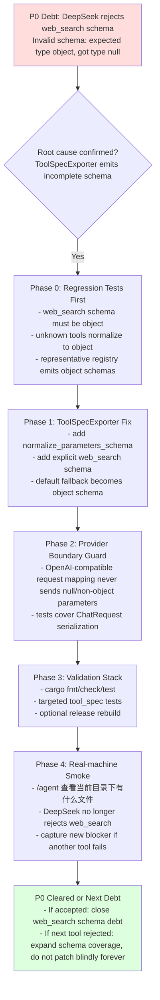

# HAJIMI P0 DeepSeek Tool Schema Remediation Roadmap

**文件路径**: `docs/roadmap/Hajimi ToolFix/plan/P0-DEEPSEEK-TOOL-SCHEMA-REMEDIATION-ROADMAP.md`
**生成日期**: 2026-05-30 (基于 `DEBT-AGENT-DEEPSEEK-TOOL-SCHEMA-WEB-SEARCH.md` + 代码采样)
**目标**: 解决 `/agent` 在 DeepSeek/OpenAI-compatible 路径下因 `web_search` 工具 schema 不合格导致的 400 Bad Request。遵循 **测试优先、最小变更、分层合规、数据诚实** 原则，先建立 schema 门禁，再补齐 `web_search` 与兜底规范化，避免后续一个工具一个工具地爆雷。

---

## 优先级 (P0-Blocker 第一)

1. **P0 DeepSeek 请求可接受 (Critical)**: 所有发送给模型的 tool `function.parameters` 必须是顶层 `type: "object"` 的 JSON Schema。
2. **P0 `web_search` 明确 schema (Critical)**: `web_search` 必须导出 `{ query: string }` 参数结构，不能再落入 `{}` 或 `type:null`。
3. **P0 全工具 schema 兜底 (High)**: 未覆盖工具不能再导出空 schema；必须被规范化为安全 object schema。
4. **P1 请求层防线 (Medium)**: OpenAI-compatible client 在发送前增加轻量断言或 normalization，防止上游漏网。
5. **P1 文档闭环 (Medium)**: 更新 debt、INDEX/ARCHITECTURE 或 roadmap 状态，记录修复边界和未实机验证项。

**总原则**:
- 先写失败测试，再改生产代码。
- 优先修 `src/intelligence/agent-core/llm_native/tool_spec.rs`，不要先动 UI。
- 不引入新 crate，不改变四层分层规则。
- Intelligence 层可以依赖 Engine；Engine 层不能依赖 Intelligence/Interface。
- DeepSeek 报错修复不能靠隐藏 `web_search`，除非作为临时止损。
- 不把 `{}` 当作模型工具参数 schema 的长期输出。
- 每个导出给模型的工具 schema 都要可被 OpenAI-compatible provider 接收。
- 实机 `/agent` 验证必须诚实记录；没跑就写“未验证”。

---

## 路线规划图 (Mermaid流程图)



---

## 文件修改清单

### 必改文件

| 文件 | 修改类型 | 目标 |
|---|---|---|
| `src/intelligence/agent-core/llm_native/tool_spec.rs` | 生产代码 + 单元测试 | 增加 `web_search` schema；增加 schema normalization；更新旧测试中“unknown -> {}”的预期 |
| `src/engine/llm-core/src/openai.rs` | 生产代码 + 单元测试 | 在 OpenAI-compatible 发送边界增加最后一道 schema 规范化或断言，确保 `function.parameters.type == "object"` |

### 建议同步文件

| 文件 | 修改类型 | 目标 |
|---|---|---|
| `docs/debt/DEBT-AGENT-DEEPSEEK-TOOL-SCHEMA-WEB-SEARCH.md` | 文档状态 | 修复后追加验证结果、commit、剩余风险 |
| `src/INDEX.md` | 文档索引 | 如新增/公开 schema helper 或测试门禁，更新对应模块说明 |
| `src/ARCHITECTURE.md` | 架构说明 | 如新增“LLM-Native Tool Schema Boundary”规则，记录 Intelligence -> Engine 的工具 schema 合同 |

### 原则上不改文件

| 文件 | 原因 |
|---|---|
| `src/interface/web/app.js` | 这不是前端展示问题 |
| `src/interface/desktop/src/main.rs` | 当前问题不是注册缺失；`WebSearchTool` 已注册 |
| `src/engine/tool-system/src/network.rs` | `web_search` 执行逻辑不是当前失败点；当前失败发生在模型请求前 |

---

## 详细执行步骤 (最小成本原则)

### Step 0: 基线确认与止损边界 (15-30 mins)

- 确认当前分支和工作区：
  ```bash
  git status -sb
  git branch --show-current
  ```
- 确认债务文档仍存在：
  ```bash
  rg -n "Invalid schema|web_search|ToolSpecExporter" docs/debt/DEBT-AGENT-DEEPSEEK-TOOL-SCHEMA-WEB-SEARCH.md
  ```
- 确认当前 `web_search` 仍由 registry 导出：
  ```bash
  rg -n "WebSearchTool|web_search|ToolSpecExporter::from_registry" src/interface/desktop/src/main.rs src/intelligence/agent-core/llm_native/tool_spec.rs
  ```

**验收标准**:
- [ ] 工作区改动范围已知。
- [ ] 不回滚用户已有脏改动。
- [ ] 当前修复范围锁定为 schema 导出/发送边界。

---

### Step 1: 测试优先 - 复现 schema 合同缺口 (45-60 mins)

目标文件：`src/intelligence/agent-core/llm_native/tool_spec.rs`

新增或修改测试：

| 测试名 | 目的 |
|---|---|
| `test_web_search_schema_is_deepseek_compatible_object` | 注册 `WebSearchTool` 后导出的 schema 顶层必须是 `type:"object"`，并包含 `query:string` |
| `test_unknown_tool_schema_normalizes_to_object` | 未知工具不能再导出 `{}`；必须导出安全 object schema |
| `test_exported_registry_schemas_are_all_objects` | 代表性 registry 中每个 `ModelVisibleToolSpec.parameters_schema` 顶层都是 object |
| `test_parse_schema_safely_normalizes_malformed_json` | malformed raw schema 不得返回裸 `{}` 或 null，应返回 object fallback |

建议断言片段：

```rust
assert_eq!(schema.get("type").and_then(|v| v.as_str()), Some("object"));
assert!(schema.get("properties").and_then(|v| v.as_object()).is_some());
```

`web_search` 目标断言：

```rust
let query = schema
    .get("properties")
    .and_then(|v| v.get("query"))
    .expect("web_search.query schema missing");
assert_eq!(query.get("type").and_then(|v| v.as_str()), Some("string"));
assert!(schema["required"].as_array().unwrap().contains(&serde_json::json!("query")));
```

**预期**:
- 在生产代码未修前，至少 `web_search` 或 unknown schema 测试失败。

**验收标准**:
- [ ] 测试能准确描述 DeepSeek 的 schema 合同。
- [ ] 测试不需要真实 DeepSeek API key。
- [ ] 测试不依赖 Interface 层，保持分层干净。

---

### Step 2: 修 `ToolSpecExporter` - 明确 schema + 全局兜底 (1-2 hours)

目标文件：`src/intelligence/agent-core/llm_native/tool_spec.rs`

#### 2.1 新增 normalization helper

建议新增函数：

```rust
fn normalize_parameters_schema(schema: Value) -> Value
```

规则：

1. 如果 `schema` 不是 JSON object，返回：
   ```json
   { "type": "object", "properties": {}, "additionalProperties": true }
   ```
2. 如果是 object 但没有 `type`，补 `"type": "object"`。
3. 如果 `type` 不是 `"object"`，为 tool parameters 强制降级为安全 object fallback。
4. 如果没有 `properties`，补 `{}`。
5. 保留已有 `required`、`description`、`additionalProperties`。

人话版：每张工具说明卡出门前都检查一下。没写格式的补格式，写歪的换成安全空卡，写对的尽量原样保留。

#### 2.2 添加 `web_search` 静态 schema

在 `get_tool_schema` match 中添加：

```rust
"web_search" => serde_json::json!({
    "type": "object",
    "properties": {
        "query": {
            "type": "string",
            "description": "Search query"
        }
    },
    "required": ["query"],
    "additionalProperties": false
}),
```

#### 2.3 修改默认分支

把：

```rust
_ => serde_json::json!({}),
```

改为明确 fallback：

```rust
_ => Self::default_object_schema(),
```

或先返回 `{}` 再统一调用 `normalize_parameters_schema`。推荐后者，因为它能覆盖未来手写 schema 漏字段。

#### 2.4 在导出路径统一调用

将：

```rust
let schema = Self::get_tool_schema(&display_name);
```

改为：

```rust
let schema = Self::normalize_parameters_schema(Self::get_tool_schema(&display_name));
```

**验收标准**:
- [ ] `web_search` schema 顶层 `type` 为 `object`。
- [ ] `web_search.properties.query.type == "string"`。
- [ ] unknown tool fallback 也有 `type:"object"`。
- [ ] 旧测试 `test_missing_schema` 更新为新的安全预期。

---

### Step 3: 修 OpenAI-compatible 发送边界 (45-90 mins)

目标文件：`src/engine/llm-core/src/openai.rs`

目的：即使 Intelligence 层未来漏了，也不要在 Engine 发送 `type:null` 给 DeepSeek。

建议新增私有 helper：

```rust
fn normalize_tool_parameters_for_openai(parameters: serde_json::Value) -> serde_json::Value
```

规则与 Step 2 保持一致，但放在 `openai.rs` 内部，不引入跨层依赖。

修改 mapped_tools：

```rust
"parameters": normalize_tool_parameters_for_openai(t.parameters)
```

新增/扩展测试：

| 测试名 | 目的 |
|---|---|
| `test_openai_tool_parameters_normalizes_empty_schema` | `{}` 被补为 `{ type:"object", properties:{} }` |
| `test_openai_tool_parameters_normalizes_null_schema` | `null` 被补为 object fallback |
| `test_openai_chat_request_serialization_tools_are_objects` | ChatRequest 序列化后 tools[*].function.parameters.type 都是 object |

**验收标准**:
- [ ] Engine 层不依赖 Agent/Core 类型。
- [ ] OpenAI request payload 不会出现 `function.parameters.type == null`。
- [ ] 原有 `test_openai_chat_request_serialization` 不倒退。

---

### Step 4: 代表性 registry 覆盖测试 (45-60 mins)

目标文件：`src/intelligence/agent-core/llm_native/tool_spec.rs`

构造代表性工具集合，至少包含：

- `WebSearchTool`
- `ReadFileTool`
- `WriteFileTool`
- 一个 unknown `DummyTool`

测试目标：

```rust
for spec in specs {
    assert_eq!(
        spec.parameters_schema.get("type").and_then(|v| v.as_str()),
        Some("object"),
        "tool {} exported non-object schema: {}",
        spec.name,
        spec.parameters_schema
    );
}
```

注意：
- 不要从 `interface/desktop` 反向引用 `build_registry`，会破坏分层。
- 如需真实工具，使用 `engine_tool_system` 已导出的工具类型。
- 如果某些工具构造需要 workspace path，可用最小 dummy 或仅测 schema exporter 的 representative set。

**验收标准**:
- [ ] 测试能防止 `web_search` 回归。
- [ ] 测试能防止 unknown tool 再输出空 schema。
- [ ] 不引入 Interface 依赖。

---

### Step 5: 文档同步与 debt 状态更新 (30-45 mins)

目标文件：

- `docs/debt/DEBT-AGENT-DEEPSEEK-TOOL-SCHEMA-WEB-SEARCH.md`
- `src/INDEX.md`
- `src/ARCHITECTURE.md`

建议更新内容：

1. 在 debt 文档新增 `Repair Plan / Implementation Result` 小节。
2. 如果代码已实现，记录：
   - commit SHA
   - 验证命令
   - 是否实机复测 DeepSeek
   - 是否仍有其他工具 schema 风险
3. 在 `src/INDEX.md` 的 `llm_native/tool_spec.rs` 描述中补充“DeepSeek-compatible schema normalization”。
4. 在 `src/ARCHITECTURE.md` 的 LLM-Native/tool export 说明处补充 schema 合同：
   - 模型可见工具参数必须是 JSON Schema object。
   - Engine OpenAI-compatible 边界会做最后兜底。

**验收标准**:
- [ ] 文档没有宣称未完成的实机验证。
- [ ] INDEX/ARCHITECTURE 只更新与 schema contract 有关的内容。
- [ ] debt 状态不提前写 `FIXED`，除非实机 DeepSeek 已通过。

---

### Step 6: 验证命令与实机冒烟 (60 mins)

必须运行：

```bash
cargo fmt -- --check
cargo check -p intelligence-agent-core
cargo check -p engine-llm-core
cargo check -p hajimi-desktop
cargo test -p intelligence-agent-core --lib
```

建议加跑 targeted tests：

```bash
cargo test -p intelligence-agent-core web_search_schema -- --nocapture
cargo test -p intelligence-agent-core exported_registry_schemas_are_all_objects -- --nocapture
cargo test -p engine-llm-core openai_tool_parameters -- --nocapture
```

实机复测：

1. 重新编译可运行版本：
   ```bash
   cargo build -p hajimi-desktop --release
   ```
2. 如果使用完整 Tauri 包：
   ```bash
   cd src/interface/desktop
   cargo tauri build
   ```
3. 在 Hajimi 内选择 DeepSeek provider。
4. 执行：
   ```text
   /agent 查看当前目录下有什么文件
   ```
5. 记录 Agent Trace 中是否仍出现：
   ```text
   Invalid schema for function 'web_search'
   ```

**验收标准**:
- [ ] 单元测试全绿。
- [ ] `cargo check -p hajimi-desktop` 通过。
- [ ] DeepSeek 不再返回 `Invalid schema for function 'web_search'`。
- [ ] 如果出现下一个工具 schema 错误，新增 debt 或扩展本计划，不把结果写成完成。

---

## 测试用例清单

### Unit Tests - `tool_spec.rs`

| ID | 测试名 | 输入 | 期望 |
|---|---|---|---|
| TS-001 | `test_web_search_schema_is_deepseek_compatible_object` | registry 注册 `WebSearchTool` | schema 顶层 `type:"object"`，包含 `query:string`，required 包含 `query` |
| TS-002 | `test_unknown_tool_schema_normalizes_to_object` | registry 注册 `DummyTool("unknown_dummy_tool")` | schema 不再是 `{}`，顶层 `type:"object"`，properties 是 object |
| TS-003 | `test_parse_schema_safely_normalizes_malformed_json` | raw `{invalid json}` | 返回 object fallback，不 panic |
| TS-004 | `test_exported_registry_schemas_are_all_objects` | representative registry | 所有 specs 的 parameters_schema 顶层为 object |
| TS-005 | `test_existing_read_file_schema_preserved` | `ReadFileTool` | `path` required 不丢失 |

### Unit Tests - `openai.rs`

| ID | 测试名 | 输入 | 期望 |
|---|---|---|---|
| OA-001 | `test_openai_tool_parameters_normalizes_empty_schema` | `{}` | 输出 `type:"object"` |
| OA-002 | `test_openai_tool_parameters_normalizes_null_schema` | `Value::Null` | 输出 object fallback |
| OA-003 | `test_openai_tool_parameters_preserves_valid_schema` | web_search schema | `query`、`required`、`additionalProperties` 保留 |
| OA-004 | `test_openai_chat_request_serialization_tools_are_objects` | ChatRequest with tools | serialized tools[*].function.parameters.type == object |

### Integration / Smoke

| ID | 场景 | 操作 | 期望 |
|---|---|---|---|
| SM-001 | DeepSeek `/agent` 基础启动 | `/agent 查看当前目录下有什么文件` | 不再因 `web_search` schema 400 失败 |
| SM-002 | 非 web_search 任务仍接受全工具清单 | `/agent 创建一个 smoke txt 文件` | 若失败，错误不是 `Invalid schema for function 'web_search'` |
| SM-003 | 下一工具暴露检查 | 观察 Agent Trace | 如出现另一个 function schema 错误，记录新 debt，不宣称清债完成 |

---

## Definition of Done

- [ ] `web_search` 导出的模型可见 schema 是 DeepSeek-compatible object schema。
- [ ] unknown tool 不再导出 `{}` 或 `null`。
- [ ] OpenAI-compatible client 发送边界不会放出 `type:null`。
- [ ] 相关单元测试覆盖 `web_search`、unknown fallback、OpenAI request serialization。
- [ ] `cargo fmt -- --check` 通过。
- [ ] `cargo check -p intelligence-agent-core` 通过。
- [ ] `cargo check -p engine-llm-core` 通过。
- [ ] `cargo check -p hajimi-desktop` 通过。
- [ ] `cargo test -p intelligence-agent-core --lib` 通过。
- [ ] debt 文档记录修复结果和实机验证状态。
- [ ] 如果未做实机 DeepSeek 复测，最终结论必须写“未实机验证”。

---

## 风险 & 回滚

### 风险

- **风险 1: 只修 `web_search` 后下一个工具继续失败**
  应对：实施全局 normalization，不走纯单点补丁。

- **风险 2: OpenAI/DeepSeek 对 schema 严格程度不同**
  应对：采用 OpenAI-compatible 最严格公共子集：顶层 `type:"object"` + object `properties`。

- **风险 3: fallback object schema 让模型误以为未知工具不需要参数**
  应对：这是兜底，不是理想 schema。后续应逐步补齐高频工具的精确 schema。

- **风险 4: 在 Engine 层重复 normalization 看起来重复**
  应对：这是边界防线。Intelligence 负责正确导出，Engine 负责不发送非法请求。

### 回滚

- 代码回滚：`git revert <commit>`。
- 运行时止损：若 schema normalization 引发新问题，可临时在 `ToolSpecExporter` 中 allowlist 仅导出已知 schema 工具，但必须记录 debt。
- 文档回滚：若实机未过，不把 debt 状态改为 `FIXED`。

---

## 禁止事项

- 禁止通过隐藏 `web_search` 来假装修复，除非写明是临时止损。
- 禁止把 provider 400 吞掉再 fallback 到 legacy。
- 禁止让 `/agent` 再出现 `read_file(Cargo.toml)` 这种遮蔽真实错误的二次失败。
- 禁止引入 Interface -> Intelligence 的反向依赖。
- 禁止在没有实机 DeepSeek 验证时关闭 debt。

---

## 预期成果

- `/agent` 不再被 `web_search` schema 在请求前拦死。
- 工具 schema 导出层有可回归测试。
- OpenAI-compatible 发送边界有最后兜底。
- 后续如果还有工具 schema 问题，会暴露为具体工具名，而不是回到假错误。
- 计划执行后，`DEBT-AGENT-DEEPSEEK-TOOL-SCHEMA-WEB-SEARCH` 可进入 `FIXED / VERIFIED` 或 `PARTIAL / NEXT TOOL EXPOSED` 状态。

---

## 下一步

用户批准后执行 Step 1-6。推荐先完成测试与 `ToolSpecExporter` 修复，再决定是否需要 Engine 发送边界兜底。若时间有限，最低可交付是 Step 1 + Step 2 + targeted tests；但 P0 完整清债建议包含 Step 3 和实机 DeepSeek smoke。
