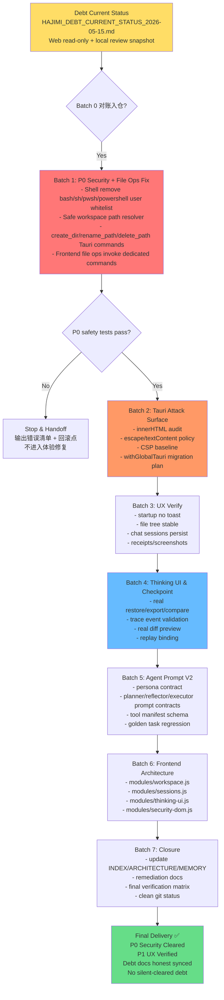

# HAJIMI Debt Remediation Roadmap

**文件路径建议**: `docs/roadmap/hajimi debtFix/plan/HAJIMI_DEBT_REMEDIATION_ROADMAP_2026-05-15.md`  
**生成日期**: 2026-05-15  
**输入基线**: `docs/roadmap/hajimi debtFix/debt/HAJIMI_DEBT_CURRENT_STATUS_2026-05-15.md`  
**适用仓库**: `Cognitive-Architect/hajimi-code-cli`  
**Web 端核验分支**: `v3.8.0-batch-1`  
**本地复核补记**: 2026-05-16 已按本地源码和聚焦测试校准，详见债务总表的“本地复核补记”。  
**目标**: 在不大重构、不扩大战线的前提下，先清掉 P0 安全边界债和 P1 功能错配债，再逐步闭环 UX、Thinking UI、Agent Prompt、Token/Context、前端架构等债务。  
**核心原则**: 最小修复、证据优先、文档同步、可回滚、禁止“修了但没验收”。

---

## 0. 一句话结论

当前项目不是从零开始补洞，而是进入“对账后分批清债”阶段。优先路线是：

```text
Batch 0 对账入仓
→ Batch 1 安全边界 + 文件操作错配
→ Batch 2 Tauri 安全面
→ Batch 3 UX 实机验收
→ Batch 4 Thinking UI / Checkpoint 真闭环
→ Batch 5 Agent Prompt V2
→ Batch 6 前端架构拆分
→ Batch 7 文档与清债收口
```

人话版：先关煤气阀，再修灶台旋钮，最后再考虑厨房装修。别反过来，不然就是豪华开放式厨房配漏气管道，艺术含量很高，生命安全很低。

---

## 1. 当前债务优先级

### P0-Blocker 第一

1. **Shell 白名单绕过风险**  
   `src/engine/tool-system/src/shell.rs` 仍允许 `bash/sh/pwsh/powershell` 作为用户命令入口。  
   目标：禁止 shell 解释器作为用户可选命令，保留外层执行器实现，但不允许用户显式调用 shell。

2. **workspace symlink 路径逃逸**  
   `src/interface/desktop/src/main.rs` 当前对不存在目标使用 `canonicalize().unwrap_or(resolved)`，可能无法解析父目录 symlink。  
   目标：统一安全路径解析函数，对新建文件、目录、读写、删除、重命名都做父目录 canonicalize 和 workspace containment 校验。

3. **Tauri CSP/global API 暴露面**  
   `tauri.conf.json` 当前 `withGlobalTauri: true` 且 `csp: null`。  
   目标：先建立 DOM/XSS 审查清单，再开启基础 CSP，后续迁移 global Tauri API。

### P1 功能与体验

4. **文件操作功能错配**  
   前端 `createNewFolder()` / `renameFile()` / `deleteFile()` 分别调用 `run_command('mkdir/mv/rm')`，后端白名单无 `mkdir/mv/rm`。  
   目标：新增专用 `create_dir` / `rename_path` / `delete_path` commands，不把 `mkdir/rm/mv` 放进通用命令白名单。

5. **启动 / 文件树 / 会话持久化验收**  
   代码已有修复痕迹，但状态应是 `VERIFY`，不能直接清债。  
   目标：本地实机启动验收并生成 receipt。

6. **Slash Command Palette**  
   slash 命令处理已有，但输入 `/` 后提示面板缺验收。  
   目标：P1/P2 体验增强，排在安全之后。

### P1/P2 半成品体验债

7. **Thinking UI / Trace / Checkpoint**  
   trace 注入已做；checkpoint restore/export/compare 仍有占位实现。  
   目标：把演示 UI 改成可信操作记录。

8. **Operation Summary / Diff Preview**  
   当前 diff preview 偏虚拟摘要。  
   目标：接真实文件 diff 或 git diff。

### P2 质量与架构债

9. **Agent Prompt V2**  
   当前已有 Tool Manifest、Planner V1、Context Window、Persona gate，不再是原始状态。  
   目标：统一 Planner / Reflector / Executor 提示词契约和 golden regression。

10. **Token / Context**  
    多数已做，状态偏 `VERIFY/CLEARED`。  
    目标：只做回归，不抢 P0。

11. **前端 app.js/style.css 单体化**  
    风险真实存在，但不建议第一刀大重构。  
    目标：边修边切模块。

12. **Signaling PSK**  
    状态 `ARCHIVE CANDIDATE`。  
    目标：本地未发现 active signaling server / PSK runtime；待模块 owner 确认后归档，若后续恢复 signaling server 则重新打开为 P0。

---

## 2. 总原则

严格遵守以下原则：

- **最小变更**：优先新增专用函数 / command，不为了省事扩大白名单。
- **不大重构**：前端拆分只围绕本批次改动，不一次性重写 `app.js`。
- **证据优先**：每个债务从 `OPEN` 改成 `CLEARED` 必须有验证命令、输出、截图或日志。
- **安全优先**：Shell、workspace、Tauri 安全面优先于 UI polish。
- **兼容优先**：能保留旧接口就保留旧接口，feature-gate 优先于硬切。
- **文档同步**：每个 batch 完成后更新当前债务总表或新增 closure 文档。注意 `.gitignore` 当前忽略 `docs/`，需要入仓的正式债务文档必须显式 `git add -f`，或者同步到未忽略的正式入口。
- **四层架构纯洁性**：Engine / Intelligence 不依赖 Interface；Interface 只调用下层能力。
- **Windows 重点验收**：路径、symlink/junction、Tauri 启动、PowerShell 行为必须实机验证。

---

## 3. 路线规划图



---

## 4. 分批执行步骤

### Batch 0: 对账与文档入仓

**目标**: 让 Web 端、GitHub 分支、本地 workspace、债务文档先对齐。  
**预计工时**: 30-60 mins  
**风险等级**: 🟢 低  
**是否改代码**: 否，只改文档。

#### 任务

| # | 任务 | 目标文件 | 说明 |
|---:|---|---|---|
| 1 | 放入当前债务总表 | `docs/roadmap/hajimi debtFix/debt/HAJIMI_DEBT_CURRENT_STATUS_2026-05-15.md` 或正式 `docs/debt/` 入口 | 作为当前真相快照；若提交需处理 `docs/` ignore |
| 2 | 新增本 Roadmap | `docs/roadmap/hajimi debtFix/plan/HAJIMI_DEBT_REMEDIATION_ROADMAP_2026-05-15.md` | 作为批次级路线图 |
| 3 | 新增 Daily Plan | `docs/roadmap/hajimi debtFix/plan/HAJIMI_DEBT_REMEDIATION_DAILY_PLAN_2026-05-15.md` | 作为逐日执行计划 |
| 4 | 本地运行 audit 命令 | `docs/debt/local-debt-audit-*.txt` | 生成本地证据 |
| 5 | 更新索引 | `docs/debt/INDEX.md` 或旧 `INDEX.md` | 标记当前状态文档为 active snapshot |

#### 验证命令

```bash
git branch --show-current
git rev-parse HEAD
git status --short
ls docs/debt
ls "docs/roadmap/hajimi debtFix/plan"
```

#### 验收标准

- [ ] 当前债务总表已入仓
- [ ] Roadmap 已入仓
- [ ] Daily Plan 已入仓
- [ ] 本地 audit 输出存在
- [ ] 没有把任何 `OPEN` 未验证债务改成 `CLEARED`

---

### Batch 1: P0 安全边界 + 文件操作功能修复

**目标**: 清掉最危险的本机能力边界债，并修复明显功能错配。  
**预计工时**: 1-2 天  
**风险等级**: 🔴 高  
**是否改代码**: 是。

#### 任务

| # | 任务 | 目标文件 | 说明 |
|---:|---|---|---|
| 1 | 新建安全路径解析函数 | `src/interface/desktop/src/main.rs` 或新模块 | 支持 existing path / new file / new dir |
| 2 | 替换 `validate_path_within_workspace` | `main.rs` | 不再对新文件 fallback 到未解析 symlink 路径 |
| 3 | 新增 `create_dir` Tauri command | `main.rs` | 专用命令，不走 `run_command('mkdir')` |
| 4 | 新增 `rename_path` Tauri command | `main.rs` | 专用命令，不走 `run_command('mv')` |
| 5 | 新增 `delete_path` Tauri command | `main.rs` | 专用命令，不走 `run_command('rm')`；递归删除必须确认 |
| 6 | 注册三个 command | `generate_handler![]` | 前端可 invoke |
| 7 | 修改前端文件操作 | `src/interface/web/app.js` | `createNewFolder()` / `renameFile()` / `deleteFile()` 改用专用 command |
| 8 | ShellTool 移除用户 shell 白名单 | `src/engine/tool-system/src/shell.rs` | 移除 `bash/sh/pwsh/powershell` |
| 9 | 修改 shell 单测 | `shell.rs` tests | 断言 shell 解释器被拒绝 |
| 10 | 增加 symlink 测试 | `main.rs` tests 或独立测试 | 覆盖 new file / new dir / rename / delete under symlink |
| 11 | 更新债务状态 | 当前债务总表 | `OPEN -> VERIFY`，不要直接 CLEARED |

#### 验证命令

```bash
cargo test -p engine-tool-system -- test_allow_list
cargo check --workspace
node --check src/interface/web/app.js
```

Windows 实机补充：

```powershell
cargo check --workspace
cargo test -p engine-tool-system -- test_allow_list
node --check src/interface/web/app.js
cd src/interface/desktop
cargo tauri dev
```

#### 手动验收

```text
1. 点击“新建文件夹”成功创建 workspace 内目录
2. 重命名 workspace 内文件/目录成功
3. 删除 workspace 内文件/目录经确认后成功
4. create_dir("../outside") 被拒绝
5. workspace/link -> outside 后，create_dir("link/x") / rename_path("safe", "link/x") / delete_path("link/x") 被拒绝
6. shell 工具拒绝 bash/sh/pwsh/powershell
7. git status / cargo check 等允许命令仍可运行
```

#### 回滚策略

```bash
git restore src/interface/desktop/src/main.rs src/interface/web/app.js src/engine/tool-system/src/shell.rs
```

---

### Batch 2: Tauri 安全面收敛

**目标**: 降低未来 XSS 的后果，建立前端安全渲染规范。  
**预计工时**: 1-2 天  
**风险等级**: 🔴 高  
**是否改代码**: 是。

#### 任务

| # | 任务 | 目标文件 | 说明 |
|---:|---|---|---|
| 1 | 建立 DOM 渲染风险清单 | `docs/debt/SECURITY-DOM-AUDIT.md` | 列出所有 `innerHTML` / 模板拼接点 |
| 2 | 新增统一 escape/text render helper | `src/interface/web/app.js` 或 `modules/security-dom.js` | 不一次性大重构 |
| 3 | 替换高风险 HTML 拼接点 | `app.js` | 文件名、Git 输出、模型输出、错误信息优先 |
| 4 | 开启基础 CSP | `src/interface/desktop/tauri.conf.json` | 先保守，确保应用能启动 |
| 5 | 制定 global Tauri API 迁移计划 | Roadmap 文档 | 关闭 `withGlobalTauri` 可分后续 batch |
| 6 | 恶意输入验收 | 本地手工 | 文件名、聊天内容、Git 输出不执行 JS |

#### 建议 CSP 起点

```text
default-src 'self';
script-src 'self';
style-src 'self' 'unsafe-inline';
img-src 'self' asset: data:;
connect-src 'self' http://127.0.0.1:*;
```

#### 验证命令

```bash
node --check src/interface/web/app.js
cargo check -p hajimi-desktop
```

#### 手动验收

```text
恶意文件名：
恶意聊天内容：<script>alert(1)</script>
恶意 Git 输出：包含 HTML 标签
预期：只显示文本，不执行脚本
```

#### 回滚策略

```bash
git restore src/interface/desktop/tauri.conf.json src/interface/web/app.js
```

---

### Batch 3: UX 验收与小修

**目标**: 把 `DEBT-UX-AGENT-001` 从 “代码看着修了” 推进到 “本地实测通过”。  
**预计工时**: 0.5-1 天  
**风险等级**: 🟡 中  
**是否改代码**: 可能。

#### 任务

| # | 任务 | 目标文件 | 说明 |
|---:|---|---|---|
| 1 | 启动验收 | 本地应用 | 无异常 toast |
| 2 | 文件树验收 | app + workspace | 显示 `hajimi-workspace` |
| 3 | 会话持久化验收 | localStorage | 关闭重开后历史保留 |
| 4 | 失败时小修 | `main.rs` / `app.js` | 只修启动路径、状态恢复相关 |
| 5 | 写入验收记录 | `docs/debt/UX-FILETREE-SESSION-VERIFY.md` | 截图 / 日志 / 命令 |

#### 验证命令

```bash
cargo check -p hajimi-desktop
node --check src/interface/web/app.js
```

#### 手动验收

```text
1. 启动应用
2. 文件树稳定加载
3. 新建会话 A，发送消息
4. 新建会话 B，发送消息
5. 切回 A，消息仍在
6. 关闭应用再打开，A/B 会话仍在
```

---

### Batch 4: Thinking UI & Checkpoint 真闭环

**目标**: 把“看起来有 trace/checkpoint UI”改成“能作为可信操作记录”。  
**预计工时**: 2-3 天  
**风险等级**: 🟡 中  
**是否改代码**: 是。

#### 任务

| # | 任务 | 目标文件 | 说明 |
|---:|---|---|---|
| 1 | Trace 链路验收 | `main.rs` / `app.js` | 确认真实 AgentLoop events 到前端 |
| 2 | 实现 `export_checkpoint` | `main.rs` | 返回真实 JSON/Markdown |
| 3 | 实现 `compare_checkpoints` | `main.rs` | 返回真实 diff 结构，而不是 bool false |
| 4 | 实现 `restore_checkpoint` | `main.rs` | 恢复需要强确认 |
| 5 | Operation Summary 接真实 diff | `app.js` / backend | 替换虚拟 diff |
| 6 | Replay 绑定 checkpoint | `app.js` / backend | 从 timeline 回放真实事件 |

#### 验证命令

```bash
cargo check -p hajimi-desktop
node --check src/interface/web/app.js
rg -n "restore_checkpoint|compare_checkpoints|export_checkpoint" src/interface/desktop/src/main.rs
```

#### 验收标准

- [ ] Checkpoint 导出不是 `{}` 占位
- [ ] Compare 返回可展示 diff
- [ ] Restore 有确认机制
- [ ] Trace 面板有真实事件来源
- [ ] Operation Summary 可关联真实文件变更

---

### Batch 5: Agent Prompt V2 质量增强

**目标**: 在 P0/P1 稳住后，统一 Agent 的 Planner / Reflector / Executor 提示词契约。  
**预计工时**: 2-4 天  
**风险等级**: 🟡 中  
**是否改代码**: 是。

#### 任务

| # | 任务 | 目标文件 | 说明 |
|---:|---|---|---|
| 1 | 写 Persona 契约 | `docs/agent-prompt-core/AGENT-PERSONA.md` | 明确边界、风格、安全 |
| 2 | 固化 Tool Manifest Schema | `docs/agent-prompt-core/TOOL-MANIFEST-SCHEMA.md` | 与代码 DTO 对齐 |
| 3 | Planner Prompt Contract | `docs/agent-prompt-core/PLANNER-PROMPT-CONTRACT.md` | 输入/输出/失败降级 |
| 4 | Reflector Contract | `docs/agent-prompt-core/REFLECTOR-CONTRACT.md` | root cause / stop-loss |
| 5 | Executor Contract | `docs/agent-prompt-core/EXECUTOR-CONTRACT.md` | tool call / governance |
| 6 | Golden Task Regression | `tests/agent_prompt_golden/*` | 基础任务回归 |
| 7 | Feature-gate 验收 | env vars | 保证可回滚 |

#### 验证命令

```bash
cargo test -p intelligence-agent-core --lib
cargo check --workspace
```

---

### Batch 6: 前端架构渐进拆分

**目标**: 不重写前端，只把高风险/高频区域拆成小模块。  
**预计工时**: 2-5 天  
**风险等级**: 🟡 中  
**是否改代码**: 是。

#### 建议模块

```text
src/interface/web/modules/
  workspace.js
  sessions.js
  command-palette.js
  slash-palette.js
  thinking-ui.js
  security-dom.js
```

#### 拆分顺序

1. `security-dom.js`：escape / safe render helper
2. `workspace.js`：workspace init / file tree / create dir
3. `sessions.js`：chat sessions persistence
4. `thinking-ui.js`：thinking block / trace / operation summary
5. `command-palette.js`：command list / agent commands
6. `slash-palette.js`：slash prompt UI

#### 验证命令

```bash
node --check src/interface/web/app.js
Get-ChildItem -LiteralPath src/interface/web/modules -Filter *.js | ForEach-Object { node --check $_.FullName }
```

---

### Batch 7: Closure & 清债文档闭环

**目标**: 避免“修完代码但文档继续撒谎”。  
**预计工时**: 0.5-1 天  
**风险等级**: 🟢 低  
**是否改代码**: 文档为主。

#### 任务

| # | 任务 | 目标文件 | 说明 |
|---:|---|---|---|
| 1 | 创建清债总结 | `docs/debt/DEBT-REMEDIATION-CLOSURE-2026-05-xx.md` | 总结所有 batch |
| 2 | 更新当前债务总表 | `HAJIMI_DEBT_CURRENT_STATUS_2026-05-15.md` | 每项状态更新 |
| 3 | 更新 INDEX | `docs/debt/INDEX.md` 或 `src/INDEX.md` | Active / Cleared / Archive |
| 4 | 更新 ARCHITECTURE | `src/ARCHITECTURE.md` | 路径安全、Agent、Memory、Checkpoint |
| 5 | 最终验证矩阵 | closure 文档 | 命令、输出、截图路径 |
| 6 | Git 状态清理 | repo | `git status --short` 干净 |

#### 最终验收命令

```bash
cargo check --workspace
cargo test -p engine-tool-system
cargo test -p intelligence-agent-core --lib
node --check src/interface/web/app.js
git status --short
```

---

## 5. 预期成果

- **P0 Security Cleared**: Shell 用户白名单不再允许 shell 解释器；workspace symlink 逃逸关闭；Tauri 安全面有 CSP 基线。
- **P1 Function Verified**: 新建 / 重命名 / 删除使用专用 command；启动、文件树、会话持久化有本地 receipt。
- **Thinking UI 可验收**: Checkpoint 不再是占位函数；Trace / Replay / Diff 有真实数据来源。
- **Agent Prompt 降级合理**: 不抢安全优先级，进入 V2 质量增强。
- **文档一致性恢复**: 旧债务文档不再和当前代码互相打架。
- **可持续修复机制**: 每个债务都要求 receipt，不再靠“感觉修了”。

---

## 6. 风险 & 回滚

### 主要风险

| 风险 | 等级 | 应对 |
|---|---:|---|
| Shell 限制导致用户命令体验下降 | 高 | 文档明确为安全换体验；后续 sandbox 后恢复复杂 shell |
| workspace path 修复影响合法路径 | 中 | 增加 Windows/Unix 路径测试 |
| CSP 打开后前端部分功能失效 | 高 | 先 DOM audit，再保守 CSP，必要时分阶段启用 |
| 前端拆分引入回归 | 中 | 不先大重构，模块拆分跟随功能修复 |
| 本地 workspace 与 Web 分支不一致 | 中 | Batch 0 必须跑 local audit |
| Checkpoint restore 误改文件 | 高 | 必须用户确认 + dry-run + export backup |

### 回滚原则

- 每个 Batch 独立 commit。
- Batch 1/2 不与大重构混合。
- 任何 `cargo check --workspace` 大面积非本批次错误，停止扩修，先输出错误清单。
- 任何安全修复不通过测试，不能进入 UX batch。

---

## 7. 状态迁移规则

债务状态只能按下面方式迁移：

```text
OPEN -> VERIFY -> CLEARED
PARTIAL -> VERIFY -> CLEARED
UNKNOWN -> OPEN / ARCHIVE
OPEN BY DESIGN -> OPEN / VERIFY / CLEARED
```

禁止：

```text
OPEN -> CLEARED
UNKNOWN -> CLEARED
```

每次状态迁移必须附：

```text
1. 修改了什么文件
2. 跑了什么验证命令
3. 验证输出/截图/日志路径
4. 是否有回滚点
```

---

## 8. 下一步

批准后从 **Batch 0** 开始：

```text
1. 把当前债务总表、Roadmap、Daily Plan 入仓
2. 本地运行 audit 命令
3. 确认本地代码与 Web 分支差异
4. 再进入 Batch 1 P0 安全修复
```

*Generated on 2026-05-15. Revised on 2026-05-16 based on HAJIMI_DEBT_CURRENT_STATUS_2026-05-15.md plus local source/test review. This roadmap intentionally prioritizes security and evidence over feature polish.*
