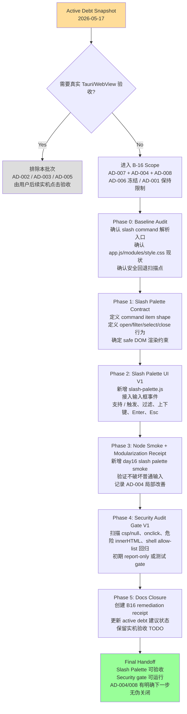

# HAJIMI B-16 Slash Palette & Safety Gate Remediation Roadmap

**文件路径**: `docs/roadmap/B16-SLASH-PALETTE-SAFETY-GATE-ROADMAP.md`
**生成日期**: 2026-05-17
**目标分支建议**: `v3.8.0-batch-2` 或 `b16-slash-palette-safety-gate`
**来源基线**: `docs/debt/ACTIVE-DEBT-STATUS-2026-05-17.md`
**目标**: 在排除需要真实 Tauri/WebView 实机验收的债务后，用最小成本推进可自动验证的活跃债：
- `AD-007 Slash command suggestion panel`
- `AD-004 Frontend modularization` 的局部推进
- `AD-008 SecurityAuditTool quality` 的轻量自动门禁
- `AD-006 Agent Prompt productization` 的 P2 冻结与后续规格约束
- `AD-001 Shell feature downgrade` 保持 `OPEN BY DESIGN`

---

## 0. 一句话结论

本批次不碰需要实机窗口证据的债务，不做大重构，不恢复复杂 shell。
核心交付是：**实现 `/` 命令建议面板 V1 + 新增前端模块边界 + 建立轻量安全门禁 + 输出债务 receipt**。

人话版：
这批不是拆楼重建，是把“用户输入 `/` 后该弹菜单”这件事补上；顺手把新功能别再塞进 `app.js` 大杂烩里；再装一个小报警器，防止安全债回魂。

---

## 1. Scope / Non-Scope

### 1.1 本批次 Scope

| Debt | 当前状态 | 本批次处理方式 | 目标状态 |
|:---|:---|:---|:---|
| `AD-007 Slash command suggestion panel` | `OPEN` | 实现 `/` 输入建议面板 V1 | `IMPLEMENTED/PENDING-UI-SMOKE` 或按项目规则关闭 |
| `AD-004 Frontend modularization` | `PARTIAL/P2` | 只把 slash palette 新功能做成独立模块，不做全量拆分 | `PARTIAL/IMPROVED` |
| `AD-008 SecurityAuditTool quality` | `OPEN/P2` | 增加轻量安全审计 gate，覆盖已知高风险回退点 | `PARTIAL/GATED` |
| `AD-006 Agent Prompt productization` | `PARTIAL/P2` | 不做大改，仅补冻结说明和后续 V2 入口 | `DEFERRED/P2-SPEC` |
| `AD-001 Shell feature downgrade` | `OPEN BY DESIGN` | 保持现状，补充“不恢复复杂 shell”的清晰理由 | `OPEN BY DESIGN` |

### 1.2 本批次 Non-Scope

| 不做项 | 原因 |
|:---|:---|
| 不关闭 `AD-002` | `withGlobalTauri` 迁移需要真实 WebView smoke 证据 |
| 不关闭 `AD-003` | Tauri GUI/WebView blocker 需要你后续亲自点验收 |
| 不关闭 `AD-005` | Thinking UI / checkpoint 仍要求真实 WebView 证据 |
| 不全量重构 `app.js` / `style.css` | 容易把小债变成泥石流，违反最小变更原则 |
| 不恢复 pipes / redirects / variables / subshells | 没有 sandbox / cwd / env / network / audit / timeout / approval 设计前，恢复复杂 shell 风险过高 |
| 不做 Agent Prompt V2 大产品化 | 已有 persona/contracts/golden regression，后续应独立成 P2 产品化 batch |

---

## 2. 优先级

1. **P1 用户可见能力：Slash Palette V1**
   用户输入 `/` 后显示可选命令，支持过滤、键盘选择、关闭和选择回填/执行。

2. **P2 架构止血：新功能模块化**
   新增 `slash-palette` 模块，避免继续把交互逻辑塞回 `app.js`。

3. **P2 自动门禁：Security Audit Gate V1**
   用 Node 脚本或测试文件扫描高风险回退点：`csp: null`、危险 `innerHTML`、`onclick=`、复杂 shell allow-list 回归等。

4. **P2 文档诚实：Debt Receipt + Active Status 更新建议**
   完成后记录真实验证命令、通过/失败输出、仍需人工验收的项目。

---

## 3. 总原则

- **最小变更**: 优先新增模块，不做大面积搬家。
- **新功能进新模块**: `slash-palette.js` 独立负责状态、过滤、渲染、键盘导航。
- **证据诚实**: Node smoke 通过只能证明 JS 层正常；不能伪装成真实 Tauri/WebView 通过。
- **安全优先**: Slash 面板渲染命令文案时必须用安全 DOM API，避免新引入 XSS。
- **可回滚**: Slash Palette 可用 feature/killswitch 关闭；Security gate 初期可 report-only，再升级为 fail gate。
- **不扩大债务面**: 不恢复复杂 shell，不迁移 `withGlobalTauri`，不动 Thinking checkpoint 深层能力。
- **文档同步**: 修改后同步 `docs/debt` receipt；必要时同步 `src/INDEX.md` / `src/ARCHITECTURE.md` 中的前端模块说明。

---

## 4. 路线规划图



---

## 5. 详细执行步骤

### Step 0: Baseline Audit & 任务边界确认

**预计工时**: 30-60 分钟
**风险等级**: 🟢 低
**目标**: 开工前确认已有 slash command 解析、前端模块结构和安全扫描点，避免闭眼乱改。

#### 任务

- 搜索 slash command 相关入口：
  ```bash
  rg "slash|command|palette|handleChatCommand|showCommandPalette" src/interface/web tests docs
  ```
- 搜索前端模块加载方式：
  ```bash
  rg "modules/|import .* from|script type=\"module\"" src/interface/web
  ```
- 搜索高风险 DOM 写法：
  ```bash
  rg "innerHTML|outerHTML|insertAdjacentHTML|onclick=|onerror=" src/interface/web
  ```
- 搜索 shell allow-list：
  ```bash
  rg "ALLOWED_COMMANDS|bash|pwsh|powershell| sh" src/engine/tool-system/src
  ```

#### 产出

- `docs/debt/B16-BASELINE-NOTES.md` 或写入最终 receipt 的 Baseline section。
- 明确哪些命令已有数据源，哪些只是解析逻辑。

#### 验收标准

- [ ] 能定位 slash command 解析入口。
- [ ] 能定位输入框事件入口。
- [ ] 能确认是否已有 command palette UI 可复用。
- [ ] 能列出 Security Gate V1 要扫描的风险点。
- [ ] 未修改业务代码。

---

### Step 1: Slash Palette Contract

**预计工时**: 1-2 小时
**风险等级**: 🟢 低
**目标**: 先定义 V1 规格，避免 UI 写着写着变成大重构。

#### 建议 command item shape

```js
{
  id: "compact",
  trigger: "/compact",
  title: "Compact context",
  description: "Compress current chat context",
  category: "context",
  riskLevel: "low",
  enabled: true
}
```

#### V1 行为

| 行为 | 规则 |
|:---|:---|
| 打开 | 输入框当前 token 以 `/` 开头时打开 |
| 过滤 | `/c` 过滤出 `/compact` 等匹配项 |
| 选择 | `ArrowUp` / `ArrowDown` 移动 active item |
| 确认 | `Enter` 选择 active item；按项目现有逻辑决定回填或执行 |
| 关闭 | `Esc`、输入清空、失焦、发送普通消息后关闭 |
| 安全渲染 | 禁止直接拼 HTML；使用 `textContent` / `createElement` |

#### 验收标准

- [ ] V1 contract 写入代码注释或 receipt。
- [ ] command item shape 不绑定具体 DOM。
- [ ] UI 行为可用 Node smoke 模拟。

---

### Step 2: Slash Palette UI V1

**预计工时**: 4-6 小时
**风险等级**: 🟡 中
**目标**: 实现可见的 `/` 建议面板。

#### 建议文件

| 文件 | 操作 |
|:---|:---|
| `src/interface/web/modules/slash-palette.js` | 新增，负责 slash palette 状态和渲染 |
| `src/interface/web/app.js` | 只做轻量接入：初始化、传入 input、注册选择回调 |
| `src/interface/web/style.css` | 只新增 slash palette 样式段，不做全量拆分 |
| `tests/frontend/day16_slash_palette_smoke.js` | 后续 Day 4 新增测试 |

#### 模块职责

`slash-palette.js` 应该负责：

- `createSlashPalette(options)`
- `open(query)`
- `close(reason)`
- `updateQuery(query)`
- `moveActive(delta)`
- `selectActive()`
- `destroy()`
- safe DOM rendering

`app.js` 只负责：

- 提供 command 数据。
- 在 input 事件中判断是否打开/更新。
- 在 keydown 中把部分按键交给 palette。
- 在选择命令后调用现有 command handler。

#### 验收标准

- [ ] 输入 `/` 能显示建议面板。
- [ ] 输入 `/xxx` 能过滤。
- [ ] `Esc` 能关闭。
- [ ] 面板渲染不使用危险 HTML 拼接。
- [ ] 普通消息输入和发送不受影响。

---

### Step 3: Keyboard & Command Integration

**预计工时**: 3-5 小时
**风险等级**: 🟡 中
**目标**: 把 UI 从“能看见”变成“能正常用”。

#### 任务

- `ArrowDown` / `ArrowUp` 切换候选项。
- `Enter` 选择当前候选项。
- `Tab` 可选：回填命令，不立即执行。
- `Esc` 关闭，且不清空用户输入。
- 鼠标 click 选择候选项。
- 当 query 无匹配项时显示空状态或关闭。
- 与现有 send message / command handler 对接。

#### 选择后策略建议

V1 建议采用保守策略：

| 命令类型 | 选择后动作 |
|:---|:---|
| 纯本地 UI 命令 | 可直接执行 |
| 会影响上下文 / 文件 / 运行状态的命令 | 先回填，不自动执行 |
| 未知命令 | 不执行，显示 disabled |

人话版：
像 `/help` 这种可以直接打开；像可能动上下文、动文件的命令，先放到输入框里，别替用户秒按确认。

#### 验收标准

- [ ] 键盘与鼠标都能选择。
- [ ] 选择 disabled 命令不会执行。
- [ ] 普通 Enter 发送消息逻辑不被破坏。
- [ ] slash palette 可被关闭和重新打开。
- [ ] 无新 console error。

---

### Step 4: Node Smoke & Modularization Receipt

**预计工时**: 2-4 小时
**风险等级**: 🟢 低
**目标**: 用可重复测试证明 JS 层行为正常。

#### 建议测试文件

```text
tests/frontend/day16_slash_palette_smoke.js
```

#### 测试覆盖

- `/` 打开面板。
- `/c` 过滤候选命令。
- `ArrowDown` 改变 active index。
- `Enter` 触发选择回调。
- `Esc` 关闭面板。
- 空输入不打开。
- command title/description 使用安全 text 渲染。
- disabled command 不触发执行。

#### 验证命令

```bash
node --check src/interface/web/app.js
node --check src/interface/web/modules/slash-palette.js
node tests/frontend/day16_slash_palette_smoke.js
```

#### 验收标准

- [ ] 所有 Node smoke 通过。
- [ ] `slash-palette.js` 独立可测。
- [ ] receipt 明确写：这只证明 Node/DOM mock 层，不替代真实 WebView。
- [ ] AD-004 状态可标记为 `PARTIAL/IMPROVED`，但不建议完全关闭。

---

### Step 5: Security Audit Gate V1

**预计工时**: 3-5 小时
**风险等级**: 🟡 中
**目标**: 建立轻量自动门禁，防止安全债回归。

#### 建议文件

| 文件 | 操作 |
|:---|:---|
| `tests/security/security_audit_gate.js` | 新增，扫描固定高风险模式 |
| `package.json` | 可选，新增 `test:security-gate` script |
| `docs/debt/SECURITY-AUDIT-GATE-B16-RECEIPT.md` | 记录覆盖范围和限制 |

#### Gate V1 检查项

| 检查 | 失败条件 |
|:---|:---|
| Tauri CSP | `tauri.conf.json` 中出现 `"csp": null` |
| Global Tauri | 本批不要求关闭 `withGlobalTauri`，但记录 warning |
| Inline event | 前端新增 `onclick=` / `onerror=` 等 inline handler |
| Dangerous HTML | 新增未标注的 `innerHTML` / `insertAdjacentHTML` |
| Shell allow-list | 用户 allow-list 重新加入 `bash` / `sh` / `pwsh` / `powershell` |
| File command regression | 前端重新绕过 dedicated file commands 调 shell 做文件操作 |

#### 初期策略

建议第一版采用：

```text
严重项：fail
- csp null
- shell allow-list 恢复 bash/sh/pwsh/powershell
- inline onerror/onload/onmouseover

观察项：warn
- withGlobalTauri true
- 已存在 innerHTML 但有 SECURITY 注释
```

#### 验证命令

```bash
node tests/security/security_audit_gate.js
```

#### 验收标准

- [ ] Gate 能稳定运行。
- [ ] 对严重项返回非 0 exit code。
- [ ] 对已知历史遗留点可配置 allowlist，并要求写原因。
- [ ] receipt 明确写覆盖范围，不夸大成完整安全审计。
- [ ] AD-008 可更新为 `PARTIAL/GATED`，不建议直接关闭。

---

### Step 6: Docs Closure & Debt Receipt

**预计工时**: 1-2 小时
**风险等级**: 🟢 低
**目标**: 把本批次结果写成可审计证据。

#### 建议新增文档

```text
docs/debt/DEBT-B16-SLASH-SAFETY-REMEDIATION.md
```

#### Receipt 必须包含

- 分支 / HEAD / 日期。
- 本批处理的债务 ID。
- 改动文件清单。
- 验证命令与输出摘要。
- 哪些债可以降级或标记 partial improved。
- 哪些债不能关闭。
- 仍需用户实机点击确认的项目。
- 回滚方法。

#### 验收标准

- [ ] receipt 存在。
- [ ] 每条验证命令有结果。
- [ ] 不把 Node smoke 冒充 WebView smoke。
- [ ] `docs/debt/ACTIVE-DEBT-STATUS-2026-05-17.md` 的后续更新建议清楚。
- [ ] git status 清楚，准备提交。

---

### Step 7: Final Verification & Handoff

**预计工时**: 1-2 小时
**风险等级**: 🟢 低
**目标**: 给用户一个可以亲自点击验收的交付包。

#### 最终验证命令

```bash
node --check src/interface/web/app.js
node --check src/interface/web/modules/slash-palette.js
node tests/frontend/day16_slash_palette_smoke.js
node tests/security/security_audit_gate.js
cargo test -p engine-tool-system -- test_allow_list
```

如本批没有改 Rust，`cargo test` 可作为安全回归；如果环境太重，至少保留命令和未运行原因。

#### 交付物

- Slash Palette V1 功能。
- Slash Palette Node smoke。
- Security Audit Gate V1。
- B16 remediation receipt。
- 用户实机验收清单。

---

## 6. 预期成果

| 成果 | 说明 |
|:---|:---|
| `/` 建议面板可用 | 用户输入 `/` 能看到命令候选 |
| 前端模块边界改善 | 新功能进入 `modules/slash-palette.js` |
| Node smoke 可重复 | JS 行为有自动测试 |
| Security gate 可运行 | 已知安全回退点有自动检查 |
| 债务文档更诚实 | 明确哪些完成、哪些只是 partial、哪些必须人工验收 |
| 可回滚 | 新模块和 gate 都可单独撤销 |

---

## 7. 风险 & 回滚

### 风险

| 风险 | 影响 | 应对 |
|:---|:---|:---|
| 现有 slash command 数据源不统一 | 面板不知道展示什么 | Day 1 先做 inventory，必要时 V1 使用静态 command registry |
| `app.js` 输入逻辑耦合太重 | 接入容易破坏发送消息 | 只拦截 `/` 且 palette open 时的有限按键 |
| CSS 影响现有布局 | 面板样式污染页面 | 使用 `.slash-palette-*` 前缀 |
| Security gate 误报 | 开发体验变差 | V1 支持 allowlist + warn/fail 分级 |
| 想顺手重构太多 | 批次失控 | 触发止损：超过 6 个核心文件修改就停下来复盘 |

### 回滚

- 回滚 Slash Palette：
  ```bash
  git checkout -- src/interface/web/modules/slash-palette.js src/interface/web/app.js src/interface/web/style.css tests/frontend/day16_slash_palette_smoke.js
  ```
- 回滚 Security Gate：
  ```bash
  git checkout -- tests/security/security_audit_gate.js package.json
  ```
- 回滚文档：
  ```bash
  git checkout -- docs/debt/DEBT-B16-SLASH-SAFETY-REMEDIATION.md
  ```

---

## 8. 用户实机验收清单

> 这部分不是自动测试；留给用户后续亲自点。

- [ ] 启动 Tauri App。
- [ ] 聚焦聊天输入框。
- [ ] 输入 `/`，看到命令建议面板。
- [ ] 输入 `/c`，候选项被过滤。
- [ ] `ArrowDown` / `ArrowUp` 能移动选择。
- [ ] `Enter` 能选择命令。
- [ ] `Esc` 能关闭面板。
- [ ] 普通聊天消息仍能发送。
- [ ] 控制台无明显报错。
- [ ] 截图或日志保存到 debt receipt。

---

## 9. 建议最终 Commit

```text
feat(frontend): add slash palette v1 and lightweight security gate

- add slash-palette module with safe DOM rendering
- wire slash command suggestions into chat input
- add Node smoke coverage for slash palette behavior
- add lightweight security audit gate for known regressions
- document B16 debt remediation receipt
```

---

*本 roadmap 按 “最小成本、证据诚实、不伪关闭实机债务” 原则生成。完成后建议进入用户手动 Tauri/WebView smoke。*
