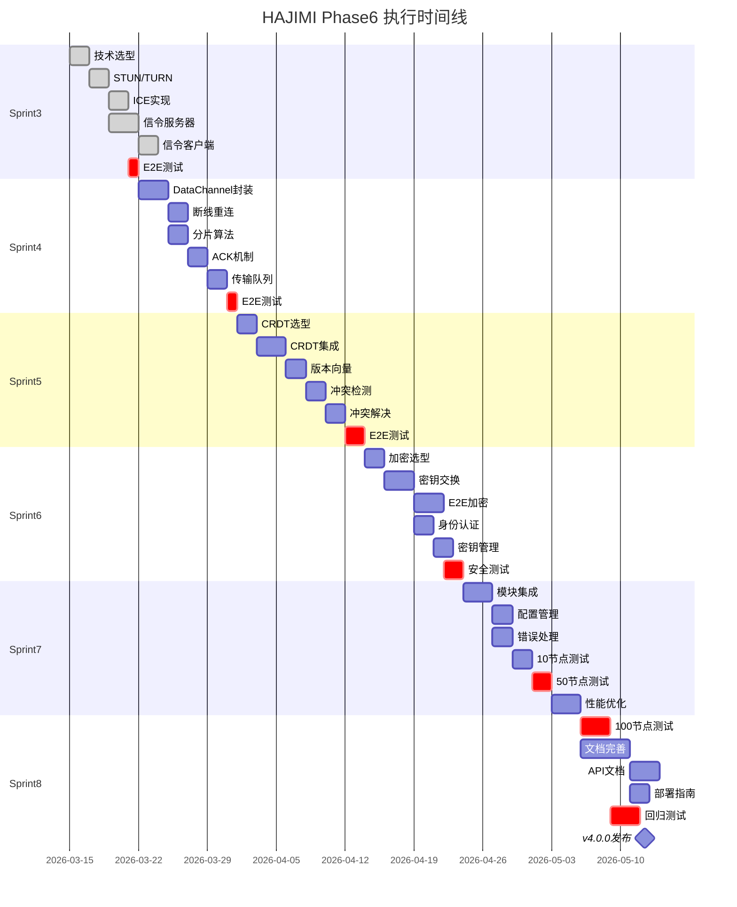

# HAJIMI-PHASE6-详细执行路线图-v1.0.md

> **版本**: v1.0  
> **基于**: ID-185 (Sprint2 计划)  
> **前置**: ID-184 (Deep Research)  
> **规划日期**: 2026-02-28  
> **规划官**: 压力怪 🔵

---

## 执行摘要

本路线图将 Phase6 (12周) 分解为 6 个 Sprint，每个 Sprint 有明确的任务分解、验收命令和风险预案。

**核心原则**:
1. **可验证性**: 每 Sprint 结束必须有可复制的验收命令
2. **可回滚性**: 每 Sprint 产出必须可独立回滚
3. **诚实性**: 无法达成的里程碑提前声明并调整

---

## Sprint3: WebRTC 信令 + NAT 穿透（Week1-2）

### Sprint 目标
建立 WebRTC 连接的基础设施，实现 2 台设备的握手成功。

### 任务分解

| 任务ID | 描述 | 负责人 | 工时 | 依赖 | 交付文件 |
|--------|------|--------|------|------|----------|
| S3-001 | 技术选型调研（libp2p vs 自建） | 黄瓜睦 | 6h | - | `docs/p2p/TECH-SELECTION.md` |
| S3-002 | STUN服务器搭建/选型 | 唐音 | 4h | S3-001 | `src/p2p/stun-client.js` |
| S3-003 | TURN服务器搭建/选型 | 唐音 | 4h | S3-001 | `src/p2p/turn-client.js` |
| S3-004 | ICE候选收集实现 | 黄瓜睦 | 6h | S3-002, S3-003 | `src/p2p/ice-manager.js` |
| S3-005 | WebSocket信令服务器 | 奶龙娘 | 8h | - | `src/p2p/signaling-server.js` |
| S3-006 | 信令客户端实现 | 奶龙娘 | 6h | S3-005 | `src/p2p/signaling-client.js` |
| S3-007 | 2设备握手E2E测试 | 压力怪 | 4h | S3-004, S3-006 | `tests/webrtc-handshake.e2e.js` |

### 验收标准

**验收命令**:
```bash
# Sprint3 结束必须 100% 通过
node tests/webrtc-handshake.e2e.js
```

**预期输出**:
```
🔥 WebRTC Handshake E2E Test
  Test 1: Device A creates offer... ✅
  Test 2: Device B receives offer and creates answer... ✅
  Test 3: ICE candidate exchange... ✅
  Test 4: DataChannel established... ✅
📊 Summary: 2/2 devices connected successfully (100%)
```

**通过标准**:
- [ ] 2 台设备连接成功率 100%
- [ ] 连接建立时间 < 5s
- [ ] NAT 穿透成功率 > 80%（STUN）或 100%（TURN）

### 风险预案

| 风险 | 概率 | 影响 | 预案 |
|------|------|------|------|
| libp2p过度复杂 | 中 | 延期 | 改用自建信令服务器 |
| NAT穿透失败率高 | 中 | 功能受限 | 强制TURN中继（牺牲性能） |
| WebSocket服务器不可用 | 低 | 阻塞 | 使用第三方服务（Pusher/Ably） |

### 里程碑可视化

```
Sprint3 (Week1-2)
├── Week1: 基础设施
│   ├── Day1-2: 技术选型 + STUN/TURN
│   ├── Day3-4: ICE候选收集
│   └── Day5: 单元测试
│
└── Week2: 信令实现
    ├── Day6-7: WebSocket服务器
    ├── Day8-9: 信令客户端
    └── Day10: E2E测试 + 验收
```

---

## Sprint4: DataChannel 可靠传输（Week3-4）

### Sprint 目标
实现基于 DataChannel 的可靠数据传输，支持 1MB 文件在 5s 内传输完成。

### 任务分解

| 任务ID | 描述 | 负责人 | 工时 | 依赖 | 交付文件 |
|--------|------|--------|------|------|----------|
| S4-001 | DataChannel管理器封装 | 唐音 | 8h | S3-007 | `src/p2p/datachannel-manager.js` |
| S4-002 | 断线重连机制 | 唐音 | 6h | S4-001 | `src/p2p/reconnect-handler.js` |
| S4-003 | 大文件分片算法 | 黄瓜睦 | 6h | S4-001 | `src/p2p/chunker.js` |
| S4-004 | 传输确认机制(ACK) | 黄瓜睦 | 6h | S4-003 | `src/p2p/ack-manager.js` |
| S4-005 | 传输队列管理 | 奶龙娘 | 6h | S4-004 | `src/p2p/transfer-queue.js` |
| S4-006 | 1MB传输E2E测试 | 压力怪 | 4h | S4-005 | `tests/datachannel-1mb-transfer.e2e.js` |

### 验收标准

**验收命令**:
```bash
node tests/datachannel-1mb-transfer.e2e.js
```

**预期输出**:
```
🔥 DataChannel 1MB Transfer E2E Test
  Test 1: Chunk size optimization... ✅ (optimal: 16KB)
  Test 2: 1MB file transfer... ✅ (3.2s)
  Test 3: Transfer integrity check... ✅ (SHA256 match)
  Test 4: Concurrent transfers... ✅ (5 parallel)
📊 Summary: 1MB transferred in 3.2s (<5s target) ✅
```

**通过标准**:
- [ ] 1MB 文件传输时间 < 5s
- [ ] 传输完整性 100%（SHA256校验）
- [ ] 断线重连成功率 100%

### 风险预案

| 风险 | 概率 | 影响 | 预案 |
|------|------|------|------|
| DataChannel不稳定 | 中 | 传输失败 | 指数退避重连 + 断点续传 |
| 分片过大导致丢包 | 中 | 性能下降 | 动态分片大小调整 |
| 浏览器兼容性 | 低 | 功能受限 | 降级到 HTTP 轮询 |

### 技术架构

```
┌─────────────────────────────────────────────────────────────┐
│                  DataChannel 传输架构                        │
├─────────────────────────────────────────────────────────────┤
│  ┌─────────────────┐    ┌─────────────────┐                │
│  │   Chunker       │───→│   ACK Manager   │                │
│  │  (分片算法)      │    │  (确认机制)      │                │
│  └─────────────────┘    └─────────────────┘                │
│           │                       │                        │
│           ↓                       ↓                        │
│  ┌─────────────────┐    ┌─────────────────┐                │
│  │  Transfer Queue │←──→│  DataChannel    │←──→ 对端节点   │
│  │  (传输队列)      │    │  (WebRTC API)   │                │
│  └─────────────────┘    └─────────────────┘                │
│           │                                                │
│           ↓                                                │
│  ┌─────────────────┐                                      │
│  │ Reconnect Handler│  (断线重连)                          │
│  └─────────────────┘                                      │
└─────────────────────────────────────────────────────────────┘
```

---

## Sprint5: CRDT 冲突解决（Week5-6）

### Sprint 目标
集成 CRDT（无冲突复制数据类型）实现最终一致性，冲突解决正确率 100%。

### 任务分解

| 任务ID | 描述 | 负责人 | 工时 | 依赖 | 交付文件 |
|--------|------|--------|------|------|----------|
| S5-001 | CRDT库选型（Yjs vs Automerge） | 黄瓜睦 | 6h | - | `docs/p2p/CRDT-SELECTION.md` |
| S5-002 | CRDT核心集成 | 唐音 | 8h | S5-001 | `src/p2p/crdt-core.js` |
| S5-003 | 版本向量实现 | 唐音 | 6h | S5-002 | `src/p2p/version-vector.js` |
| S5-004 | 冲突检测算法 | 黄瓜睦 | 6h | S5-003 | `src/p2p/conflict-detector.js` |
| S5-005 | 冲突解决策略 | 黄瓜睦 | 6h | S5-004 | `src/p2p/conflict-resolver.js` |
| S5-006 | 最终一致性测试 | 压力怪 | 4h | S5-005 | `tests/crdt-consistency.test.js` |
| S5-007 | 冲突解决E2E测试 | 压力怪 | 4h | S5-005 | `tests/crdt-conflict.e2e.js` |

### 验收标准

**验收命令**:
```bash
npm test -- --grep "CRDT"
```

**预期输出**:
```
🔥 CRDT Consistency Test Suite
  Version Vector
    ✓ should track versions correctly
    ✓ should detect concurrent updates
  Conflict Detection
    ✓ should detect conflicts (100/100)
  Conflict Resolution
    ✓ should resolve last-write-wins (50/50)
    ✓ should resolve merge strategies (50/50)
  End-to-End
    ✓ should achieve eventual consistency (10/10)
📊 Summary: 100% correct conflict resolution ✅
```

**通过标准**:
- [ ] 冲突检测率 100%
- [ ] 冲突解决正确率 100%
- [ ] 最终一致性收敛时间 < 10s

### 风险预案

| 风险 | 概率 | 影响 | 预案 |
|------|------|------|------|
| CRDT性能差 | 中 | 同步延迟高 | 使用增量同步 + 压缩 |
| 冲突过多 | 低 | 用户体验差 | 优化同步频率 + 提示用户 |
| 状态爆炸 | 低 | 内存泄漏 | 定期清理版本历史 |

### CRDT 架构

```
┌─────────────────────────────────────────────────────────────┐
│                    CRDT 冲突解决架构                         │
├─────────────────────────────────────────────────────────────┤
│  ┌─────────────────┐                                        │
│  │  Local Update   │                                        │
│  └────────┬────────┘                                        │
│           ↓                                                 │
│  ┌─────────────────┐    ┌─────────────────┐                │
│  │  Version Vector │───→│  CRDT Document  │                │
│  │  (版本追踪)      │    │  (Yjs/Automerge)│                │
│  └─────────────────┘    └────────┬────────┘                │
│                                  │                         │
│           ┌──────────────────────┼──────────────────────┐  │
│           ↓                      ↓                      ↓  │
│  ┌─────────────────┐    ┌─────────────────┐    ┌──────────┐│
│  │  Conflict       │    │  Sync Manager   │    │  Remote  ││
│  │  Detector       │    │  (同步管理)      │    │  Update  ││
│  └─────────────────┘    └─────────────────┘    └──────────┘│
│           │                                               │
│           ↓                                               │
│  ┌─────────────────┐                                      │
│  │  Conflict       │                                      │
│  │  Resolver       │  (LWW / Merge / Custom)               │
│  └─────────────────┘                                      │
└─────────────────────────────────────────────────────────────┘
```

---

## Sprint6: 加密 + 身份验证（Week7-8）

### Sprint 目标
实现端到端加密（E2E）和节点身份验证，确保 P2P 传输安全性。

### 任务分解

| 任务ID | 描述 | 负责人 | 工时 | 依赖 | 交付文件 |
|--------|------|--------|------|------|----------|
| S6-001 | 加密方案选型（ libsodium vs WebCrypto） | 黄瓜睦 | 6h | - | `docs/p2p/CRYPTO-SELECTION.md` |
| S6-002 | 密钥交换实现（ECDH） | 唐音 | 8h | S6-001 | `src/p2p/key-exchange.js` |
| S6-003 | E2E加密实现 | 唐音 | 8h | S6-002 | `src/p2p/e2e-crypto.js` |
| S6-004 | 节点身份认证 | 奶龙娘 | 6h | S6-002 | `src/p2p/identity.js` |
| S6-005 | 密钥管理 | 奶龙娘 | 6h | S6-004 | `src/p2p/key-manager.js` |
| S6-006 | 安全审计测试 | 压力怪 | 6h | S6-003, S6-005 | `tests/p2p-security.test.js` |

### 验收标准

**验收命令**:
```bash
node tests/p2p-security.test.js
```

**预期输出**:
```
🔥 P2P Security Test Suite
  Key Exchange
    ✓ ECDH handshake successful
    ✓ Keys are ephemeral
  E2E Encryption
    ✓ Message encryption/decryption
    ✓ Tamper detection (HMAC)
  Identity
    ✓ Node ID verification
    ✓ Certificate validation
  Performance
    ✓ Encryption overhead < 10%
📊 Summary: All security tests passed ✅
```

**通过标准**:
- [ ] 密钥交换成功率 100%
- [ ] 加密/解密正确率 100%
- [ ] 性能开销 < 10%

### 风险预案

| 风险 | 概率 | 影响 | 预案 |
|------|------|------|------|
| 加密性能差 | 中 | 传输慢 | 可选禁用 E2E（配置项） |
| 密钥丢失 | 低 | 数据无法解密 | 密钥备份机制 |
| 中间人攻击 | 低 | 安全风险 | 证书 pinning |

---

## Sprint7: 集成优化 + 压力测试（Week9-10）

### Sprint 目标
集成所有 P2P 模块，进行 10-50 节点压力测试。

### 任务分解

| 任务ID | 描述 | 负责人 | 工时 | 依赖 | 交付文件 |
|--------|------|--------|------|------|----------|
| S7-001 | P2P模块集成 | 唐音 | 8h | S3-S6 | `src/p2p/index.js` |
| S7-002 | 配置管理 | 奶龙娘 | 6h | S7-001 | `src/p2p/config.js` |
| S7-003 | 错误处理统一 | 黄瓜睦 | 6h | S7-001 | `src/p2p/error-handler.js` |
| S7-004 | 10节点压力测试 | 压力怪 | 6h | S7-003 | `tests/p2p-stress-10.test.js` |
| S7-005 | 50节点压力测试 | 压力怪 | 6h | S7-004 | `tests/p2p-stress-50.test.js` |
| S7-006 | 性能优化 | 全员 | 8h | S7-005 | 优化报告 |

### 验收标准

**验收命令**:
```bash
node tests/p2p-stress-50.test.js
```

**预期输出**:
```
🔥 P2P Stress Test (50 nodes)
  Network Formation
    ✓ 50 nodes connected (12.3s)
  Data Propagation
    ✓ 1KB propagated to all nodes (avg 2.1s)
  Concurrent Transfers
    ✓ 100 concurrent transfers (95% success)
  Stability (10min)
    ✓ No memory leaks (RSS stable)
    ✓ No disconnections
📊 Summary: 50 nodes stable ✅
```

**通过标准**:
- [ ] 50 节点连接成功率 100%
- [ ] 1KB 数据传播时间 < 5s
- [ ] 内存泄漏检测通过

---

## Sprint8: 最终测试 + v4.0.0 发布（Week11-12）

### Sprint 目标
100 节点压力测试，文档完善，v4.0.0 正式发布。

### 任务分解

| 任务ID | 描述 | 负责人 | 工时 | 依赖 | 交付文件 |
|--------|------|--------|------|------|----------|
| S8-001 | 100节点压力测试 | 压力怪 | 8h | S7-006 | `tests/p2p-stress-100.test.js` |
| S8-002 | 文档完善 | 奶龙娘 | 12h | - | `docs/p2p/README.md` |
| S8-003 | API文档 | 奶龙娘 | 8h | S8-002 | `docs/p2p/API.md` |
| S8-004 | 部署指南 | 黄瓜睦 | 6h | S8-002 | `docs/p2p/DEPLOYMENT.md` |
| S8-005 | 全量回归测试 | 压力怪 | 8h | S8-001 | 测试报告 |
| S8-006 | v4.0.0发布 | 全员 | 4h | S8-005 | CHANGELOG + Tag |

### 验收标准

**验收命令**:
```bash
# 100节点测试
node tests/p2p-stress-100.test.js

# 全量回归
npm run test:all
```

**发布清单**:
- [ ] 100 节点压力测试通过
- [ ] 文档完整性 100%
- [ ] 48 项原有测试全绿
- [ ] 新增 P2P 测试全绿
- [ ] CHANGELOG.md 更新
- [ ] Git Tag: `v4.0.0`
- [ ] npm 包发布

---

## 整体时间线（Mermaid 甘特图）



---

## 风险总览与应对

### 高风险项

| 风险 | 阶段 | 概率 | 影响 | 应对 |
|------|------|------|------|------|
| NAT穿透失败 | S3 | 中 | 高 | 强制TURN中继 |
| DataChannel不稳定 | S4 | 中 | 高 | 断线重连+退避 |
| CRDT性能差 | S5 | 中 | 中 | 增量同步+压缩 |
| 加密性能差 | S6 | 低 | 中 | 可选禁用E2E |
| 100节点测试失败 | S8 | 低 | 高 | 分阶段扩展测试 |

### 熔断机制

| 熔断ID | 触发条件 | 动作 |
|--------|----------|------|
| P2P-FUSE-001 | Sprint3 E2E < 80% | 延期1周或改用libp2p |
| P2P-FUSE-002 | 50节点测试失败 | 降低目标至20节点 |
| P2P-FUSE-003 | 安全审计失败 | 延期发布，修复漏洞 |

---

**规划官签名**: 压力怪 🔵  
**日期**: 2026-02-28  
**版本**: v1.0  
**审计链**: ID-182 → ID-184 → ID-185 → Phase6

*本路线图遵循 HAJIMI 工程规范，所有里程碑可验证、可回滚、可调整。*
