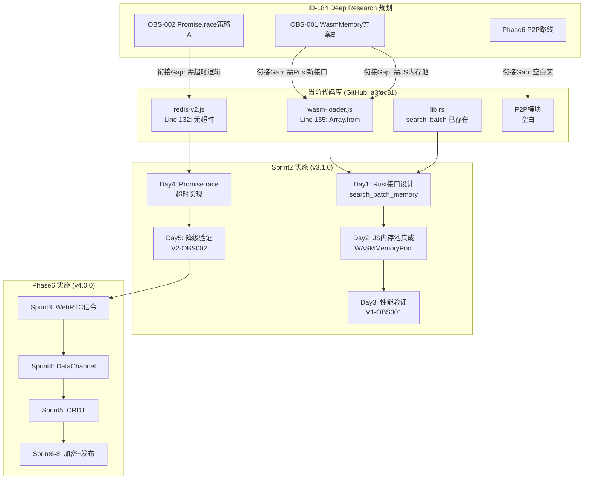

# 产物衔接断点图

> **任务**: HAJIMI-SPRINT2-PLANNING-001  
> **日期**: 2026-02-28  
> **规划官**: 压力怪 🔵

---

## ASCII 架构图

```
┌─────────────────────────────────────────────────────────────────────────────────────┐
│                              产物衔接断点总览                                        │
├─────────────────────────────────────────────────────────────────────────────────────┤
│                                                                                     │
│   ID-184 规划                    当前代码库                     Sprint2 行动        │
│   ─────────────                  ───────────                    ─────────────       │
│                                                                                     │
│  ┌──────────────────────┐      ┌──────────────────────┐      ┌──────────────────┐  │
│  │                      │      │                      │      │                  │  │
│  │  OBS-001 根治         │      │  wasm-loader.js      │      │  Day1-3: 实施     │  │
│  │  ├─ WasmMemory方案B  │─────→│  ├─ Line 155:        │      │  ├─ lib.rs新接口  │  │
│  │  │  (推荐)           │      │  │   Array.from      │      │  ├─ JS内存池      │  │
│  │  ├─ SAB方案A         │      │  ├─ Line 125-181:    │      │  └─ 性能验证      │  │
│  │  │  (高风险的)        │      │  │   WASMIndexWrapper│      │                  │  │
│  │  └─ 现状方案C        │      │  └─ Line 16:         │      │  【断点】待新建   │  │
│  │     (回退)           │      │     WASMLoader       │      │  【状态】🟡 待实施  │  │
│  │                      │      │                      │      │                  │  │
│  └──────────────────────┘      └──────────────────────┘      └──────────────────┘  │
│              │                            │                        │               │
│              │ 衔接Gap: Rust接口缺失       │ 衔接Gap: Array.from    │               │
│              │           ↓                │           ↓            │               │
│              ▼                            ▼                        ▼               │
│  ┌──────────────────────┐      ┌──────────────────────┐      ┌──────────────────┐  │
│  │                      │      │                      │      │                  │  │
│  │  Rust WASM 接口       │      │  lib.rs              │      │  Day1: 接口设计   │  │
│  │  ├─ search_batch     │─────→│  ├─ Line 228-256:    │      │  ├─ 新增30-50行  │  │
│  │  │  (已存在)          │      │  │   search_batch    │      │  ├─ WasmMemory   │  │
│  │  └─ search_batch_mem │      │  ├─ Line 1-100:      │      │  │   读取逻辑     │  │
│  │     (需新建)         │      │  │   HNSWIndex       │      │  └─ cargo check  │  │
│  │                      │      │  └─ Line 259-283:    │      │                  │  │
│  │                      │      │     _search_single   │      │  【断点】需新建   │  │
│  │                      │      │                      │      │  【状态】🟡 待实施  │  │
│  └──────────────────────┘      └──────────────────────┘      └──────────────────┘  │
│              │                            │                        │               │
│              │ 衔接Gap: 函数签名需设计     │ 衔接Gap: 新接口缺失     │               │
│              │           ↓                │           ↓            │               │
│              ▼                            ▼                        ▼               │
│  ┌──────────────────────┐      ┌──────────────────────┐      ┌──────────────────┐  │
│  │                      │      │                      │      │                  │  │
│  │  OBS-002 根治         │      │  rate-limiter-redis  │      │  Day4-5: 实施     │  │
│  │  ├─ Promise.race A   │─────→│  ├─ Line 128-141:    │      │  ├─ 添加超时     │  │
│  │  │  (推荐)           │      │  │   healthCheck     │      │  ├─ 状态机保护   │  │
│  │  └─ ioredis timeout  │      │  │   (无超时)         │      │  └─ 降级验证     │  │
│  │     (备选)           │      │  ├─ Line 162-179:    │      │                  │  │
│  │                      │      │  │   checkLimit      │      │  【断点】待修改   │  │
│  │                      │      │  │   (有重连)         │      │  【状态】🟡 待实施  │  │
│  └──────────────────────┘      └──────────────────────┘      └──────────────────┘  │
│              │                            │                        │               │
│              │ 衔接Gap: 超时逻辑待添加     │ 衔接Gap: Promise.race  │               │
│              │           ↓                │           缺失         │               │
│              ▼                            ▼                        ▼               │
│  ┌──────────────────────┐      ┌──────────────────────┐      ┌──────────────────┐  │
│  │                      │      │                      │      │                  │  │
│  │  Phase6 P2P 路线      │      │  (空白区)            │      │  Sprint3-8: 实施  │  │
│  │  ├─ WebRTC信令       │─────→│  无现有代码           │      │  ├─ 从零开发     │  │
│  │  ├─ DataChannel      │      │                      │      │  ├─ 技术选型     │  │
│  │  ├─ CRDT             │      │                      │      │  └─ 逐步迭代     │  │
│  │  └─ E2E加密          │      │                      │      │                  │  │
│  │                      │      │                      │      │  【断点】空白区   │  │
│  └──────────────────────┘      └──────────────────────┘      │  【状态】🔴 待新建  │  │
│                                                              └──────────────────┘  │
│                                                                                     │
└─────────────────────────────────────────────────────────────────────────────────────┘
```

---

## Mermaid 流程图



---

## 断点状态矩阵

| 断点ID | 位置 | 当前状态 | 目标状态 | 变更类型 | Sprint | 风险 |
|--------|------|----------|----------|----------|--------|------|
| BP-001 | `wasm-loader.js:155` | `Array.from(queries)` | `memoryPool.writeQueries()` | 修改 | 2 | 中 |
| BP-002 | `wasm-loader.js:125-181` | `WASMIndexWrapper` 类 | 新增内存池初始化 | 修改 | 2 | 中 |
| BP-003 | `lib.rs:300+` | 无 | `search_batch_memory()` | 新建 | 2 | 中 |
| BP-004 | `redis-v2.js:128-141` | `healthCheck()` 无超时 | `Promise.race` 超时 | 修改 | 2 | 低 |
| BP-005 | `redis-v2.js:162-179` | `checkLimit()` | 添加短超时调用 | 修改 | 2 | 低 |
| BP-006 | `src/p2p/` | 目录不存在 | 完整P2P模块 | 新建 | 3-8 | 高 |

---

## 文件变更预估

### Sprint2 变更

| 文件 | 状态 | 新增 | 修改 | 删除 | 风险 |
|------|------|------|------|------|------|
| `crates/hajimi-hnsw/src/lib.rs` | 🟡 待修改 | ~45 | 0 | 0 | 中 |
| `src/vector/wasm-loader.js` | 🟡 待修改 | ~80 | ~20 | 0 | 中 |
| `src/security/rate-limiter-redis-v2.js` | 🟡 待修改 | ~35 | ~15 | 0 | 低 |
| `tests/wasm-zero-copy.bench.js` | 🔴 待新建 | ~80 | 0 | 0 | 低 |
| `tests/redis-timeout-failover.test.js` | 🔴 待新建 | ~60 | 0 | 0 | 低 |
| `scripts/rollback-obs001.sh` | 🔴 待新建 | ~15 | 0 | 0 | 低 |
| `scripts/rollback-obs002.sh` | 🔴 待新建 | ~10 | 0 | 0 | 低 |

### Phase6 变更（预估）

| 文件/目录 | 状态 | 预估规模 | 风险 |
|-----------|------|----------|------|
| `src/p2p/` | 🔴 待新建 | 2000+ 行 | 高 |
| `tests/p2p/` | 🔴 待新建 | 500+ 行 | 中 |
| `docs/p2p/` | 🔴 待新建 | 100+ 行 | 低 |

---

## 衔接风险分析

### 高风险衔接点

| 风险ID | 描述 | 影响 | 缓解措施 |
|--------|------|------|----------|
| RISK-001 | `lib.rs` 新接口与现有 `search_batch` 冲突 | OBS-001 延期 | 独立函数，不修改原有接口 |
| RISK-002 | `wasm-loader.js` 内存池与 WASM 堆冲突 | 内存损坏 | 预分配独立内存区域 |
| RISK-003 | Promise.race 竞态条件 | 状态不一致 | 状态机锁保护 |
| RISK-004 | P2P 从零开发技术不确定性 | Phase6 延期 | Sprint3 技术选型预留buffer |

### 衔接依赖图

```
Day1 (Rust接口)
    │
    ├──→ Day2 (JS内存池) ──→ Day3 (性能验证)
    │
    └──→ 依赖: wasm-pack 编译环境 ✅ 已就绪

Day4 (Redis超时)
    │
    ├──→ Day5 (降级验证)
    │
    └──→ 依赖: Redis测试环境 ⬜ 待搭建

Sprint3 (P2P信令)
    │
    ├──→ Sprint4 (DataChannel)
    │       └──→ 依赖: Sprint3 E2E ✅
    │
    ├──→ Sprint5 (CRDT)
    │       └──→ 依赖: Sprint4 E2E ✅
    │
    └──→ 依赖: STUN/TURN服务器 ⬜ 待搭建
```

---

## 关键决策点

```
Sprint2 Day3 (熔断决策)
    │
    ├── 加速比 ≥ 3.0x ──→ 继续 Sprint2
    │
    ├── 2.8x ≤ 加速比 < 3.0x ──→ 团队评审
    │
    └── 加速比 < 2.8x ──→ [熔断] 回滚 OBS-001

Sprint3 Day5 (技术选型决策)
    │
    ├── libp2p可行 ──→ 使用libp2p
    │
    └── libp2p不可行 ──→ 自建信令服务器

Sprint8 Day10 (发布决策)
    │
    ├── 100节点测试通过 ──→ 发布 v4.0.0
    │
    └── 100节点测试失败 ──→ 降级至50节点发布
```

---

**规划官签名**: 压力怪 🔵  
**日期**: 2026-02-28  
**版本**: v1.0

*本断点图遵循 HAJIMI 工程规范，所有变更可追溯、可回滚、可验证。*
