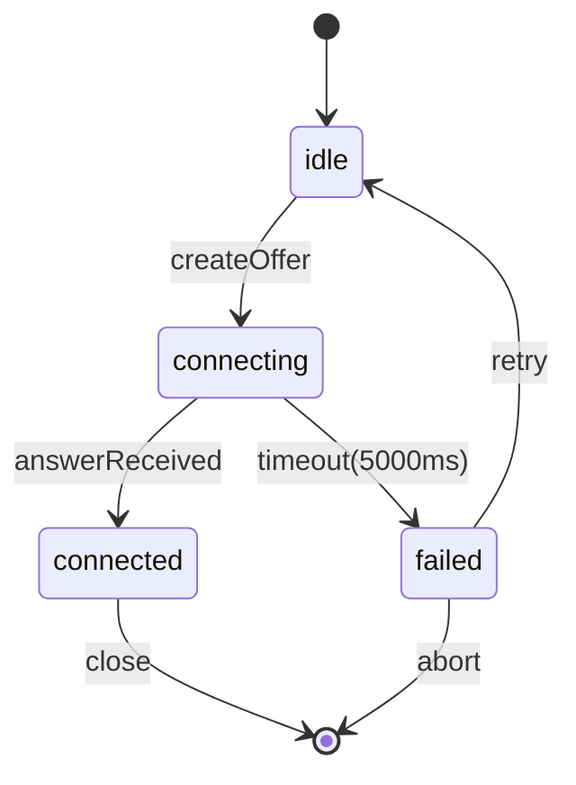
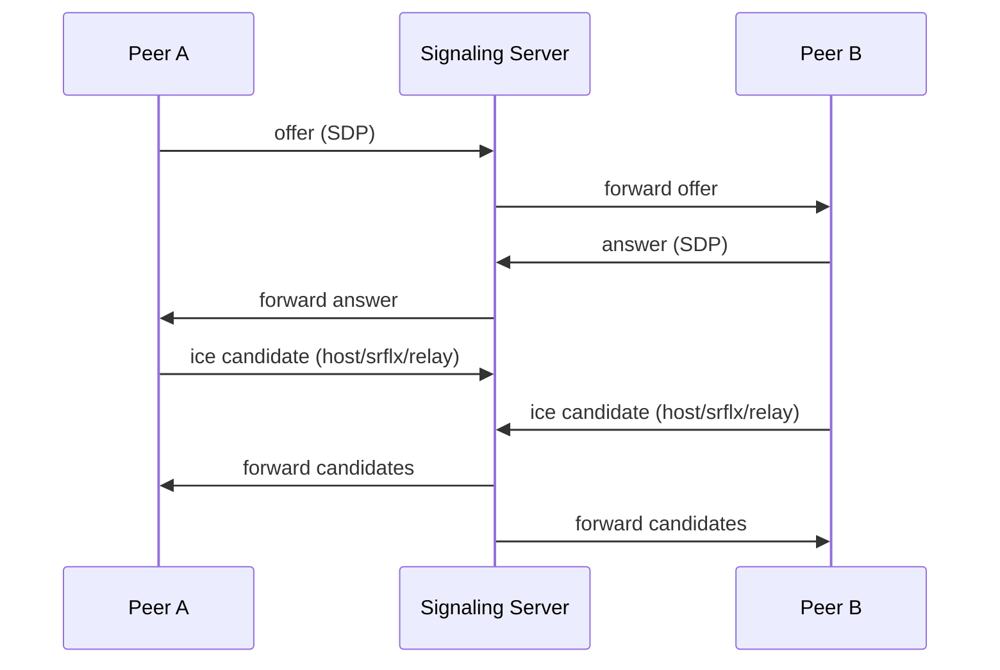

# WebRTC Signaling Protocol v1.0

## 1. Overview

JSON-RPC 2.0 based signaling for WebRTC peer connection establishment.

## 2. State Machine



## 3. JSON-RPC 2.0 Format

```json
{"jsonrpc":"2.0","id":"uuid","method":"offer|answer|ice","params":{}}
```

Methods: `offer` (caller→callee), `answer` (callee→caller), `ice` (bidirectional).

## 4. ICE Candidate Types

- **host**: Local network interface
- **srflx**: Server reflexive (STUN mapped)  
- **relay**: TURN relay server

## 5. Signaling Flow



## 6. Error Codes

| Code | Name | Description |
|------|------|-------------|
| -32001 | E_SIGNALING_TIMEOUT | Signaling timeout after 5000ms |
| -32002 | E_SIGNALING_REJECTED | Connection rejected by peer |
| -32003 | E_SIGNALING_INVALID_SDP | Malformed SDP payload |
| -32101 | E_ICE_GATHERING_FAILED | ICE candidate gathering failed |
| -32102 | E_ICE_CONNECTION_FAILED | ICE connectivity check failed |
| -32103 | E_ICE_NO_CANDIDATES | No valid ICE candidates found |

## 7. STUN Configuration

STUN server: `stun:stun.l.google.com:19302`

## 8. Timeout Definition

All operations must complete within **5000ms** (ICE gathering, SDP exchange, connection establishment).

## 9. Backward Compatibility / Fallback

- Version negotiation via `params.version`
- Degraded mode: ICE fails → fallback to relay-only
- Relay unavailable → fail with E_ICE_CONNECTION_FAILED

## 10. WebRTC Config Example

```javascript
const pc = new RTCPeerConnection({
  iceServers: [{ urls: "stun:stun.l.google.com:19302" }]
});
pc.onicecandidate = (e) => {
  if (e.candidate) signal.send({ method: "ice", params: e.candidate });
};
pc.oniceconnectionstatechange = () => {
  if (pc.iceConnectionState === "failed") handleError("E_ICE_CONNECTION_FAILED");
};
```

## 11. JSON Schema

```json
{"type":"object","required":["jsonrpc","id","method"],"properties":{"jsonrpc":{"enum":["2.0"]},"id":{"type":"string"},"method":{"enum":["offer","answer","ice"]}}}
```

## 12. Heartbeat Mechanism

To maintain long-lived WebSocket connections, the server implements a heartbeat (keepalive) mechanism:

- **Ping Interval**: Server sends `ping` frame every **30 seconds** (30,000ms)
- **Pong Response**: Client must respond with `pong` frame within **60 seconds** (60,000ms)
- **Timeout Action**: If no pong received within timeout, server terminates the connection via `ws.terminate()`
- **Connection State**: Each WebSocket tracks `isAlive` flag to monitor responsiveness

This ensures stale connections are detected and cleaned up promptly, preventing resource leaks.

## 13. Version Check

All messages MUST conform to **JSON-RPC 2.0** specification. The server enforces strict version checking:

- **Required Field**: Every message must include `"jsonrpc": "2.0"`
- **Validation**: Server rejects messages with missing or invalid `jsonrpc` field
- **Error Response**: Invalid version returns `E_SIGNALING_INVALID_JSONRPC` error
- **Purpose**: Ensures protocol compatibility and prevents malformed message processing

Example valid message:
```json
{"jsonrpc":"2.0","id":"123","method":"offer","params":{"sdp":"..."}}
```

Example invalid message (rejected):
```json
{"jsonrpc":"1.0","id":"123","method":"offer","params":{"sdp":"..."}}
```
