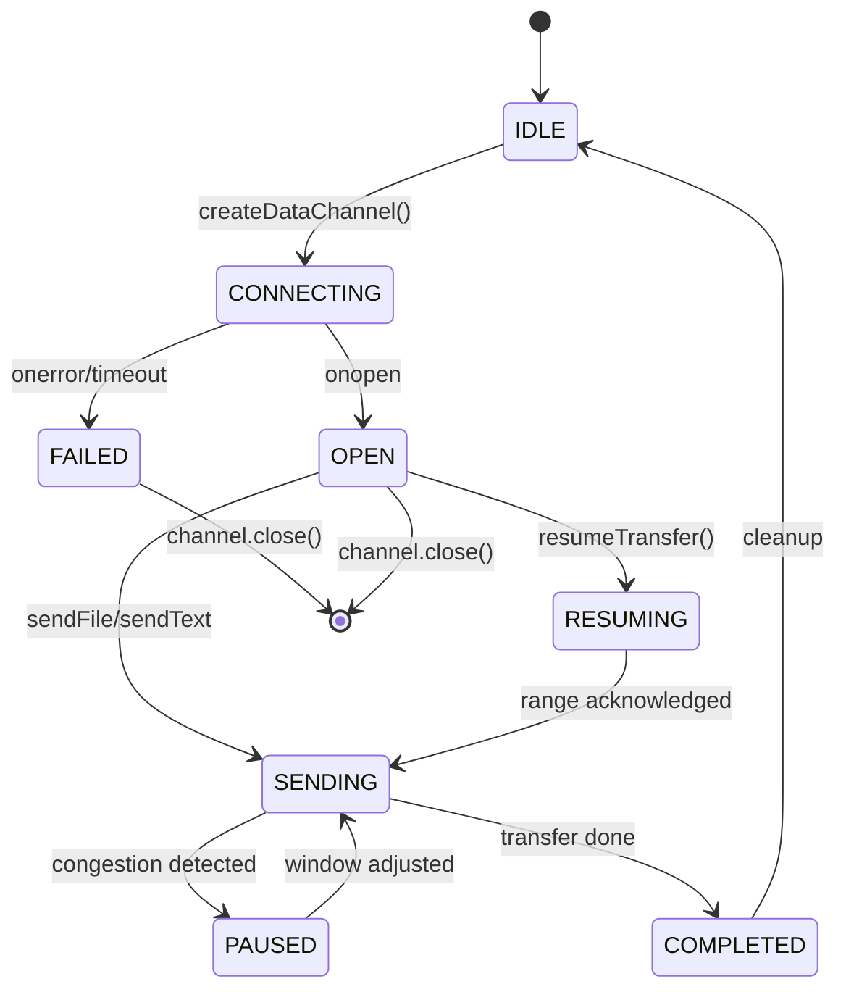

# DataChannel Protocol Specification v1.0

**Sprint4 全量实现** | 日期: 2026-02-28 | 版本: 1.0

---

## 1. 协议概述

本协议定义WebRTC DataChannel上的四层功能：文件传输、文本消息、断点续传、拥塞控制。

### 1.1 架构图

```
┌─────────────────────────────────────────────────────────────┐
│                    DataChannel Manager                       │
├─────────────┬─────────────┬─────────────┬───────────────────┤
│ File Transfer│ Text Message│   Resume    │ Congestion Control│
│  (64KB chunk)│(AES-256-GCM)│  (BLAKE3)   │  (Sliding Window) │
├─────────────┴─────────────┴─────────────┴───────────────────┤
│                    WebRTC DataChannel                        │
└─────────────────────────────────────────────────────────────┘
```

---

## 2. 状态机 (Mermaid)



---

## 3. 消息格式

### 3.1 File Chunk 消息

```json
{
  "type": "file-chunk",
  "transferId": "uuid-v4",
  "chunkIndex": 0,
  "totalChunks": 100,
  "data": "base64-encoded-binary",
  "checksum": "sha256-hash",
  "timestamp": 1709123456789
}
```

### 3.2 Text Message 消息

```json
{
  "type": "text-message",
  "seq": 1,
  "data": "base64(AES-256-GCM-ciphertext)",
  "iv": "base64-nonce",
  "authTag": "base64-auth-tag",
  "timestamp": 1709123456789
}
```

### 3.3 Resume Request 消息

```json
{
  "type": "resume-request",
  "transferId": "uuid-v4",
  "receivedChunks": [0, 1, 2, 5],
  "requestedRange": {"start": 3, "end": 4},
  "timestamp": 1709123456789
}
```

### 3.4 Congestion Control 消息

```json
{
  "type": "congestion-control",
  "action": "window-adjust",
  "windowSize": 16,
  "rtt": 45,
  "lossRate": 0.02,
  "timestamp": 1709123456789
}
```

---

## 4. 加密说明

### 4.1 AES-256-GCM 实现

```javascript
// 加密流程
const cipher = crypto.createCipheriv('aes-256-gcm', key, iv);
const encrypted = Buffer.concat([cipher.update(text), cipher.final()]);
const authTag = cipher.getAuthTag();

// 解密流程
const decipher = crypto.createDecipheriv('aes-256-gcm', key, iv);
decipher.setAuthTag(authTag);
const decrypted = Buffer.concat([decipher.update(encrypted), decipher.final()]);
```

### 4.2 密钥派生

```javascript
const key = crypto.scryptSync(sharedSecret, 'salt', 32);
```

---

## 5. 断点续传流程

```
Sender                           Receiver
   │                                 │
   │──── resume-request ────────────>│ (检测缺失分片)
   │                                 │
   │<─── resume-ack (range) ─────────│ (确认请求范围)
   │                                 │
   │──── file-chunk (range start) ──>│
   │            ...                  │
   │──── file-chunk (range end) ────>│
   │                                 │
   │<─── chunk-ack ──────────────────│ (每分片确认)
   │                                 │
   │──── transfer-complete ─────────>│
```

### 5.1 分片校验 (BLAKE3/SHA256)

```javascript
// SHA256 per chunk
const hash = crypto.createHash('sha256');
hash.update(chunkData);
const checksum = hash.digest('hex');
```

---

## 6. 拥塞控制算法

### 6.1 RTT 测量

```javascript
// 发送时间戳 → 接收ack时间戳
const rtt = Date.now() - packet.sentTimestamp;
 smoothedRTT = (1 - alpha) * smoothedRTT + alpha * rtt;
```

### 6.2 滑动窗口动态调整

```javascript
// 慢启动 → 拥塞避免
if (cwnd < ssthresh) {
  cwnd += 1; // 指数增长
} else {
  cwnd += 1 / cwnd; // 线性增长
}

// 丢包检测后
ssthresh = Math.max(cwnd / 2, 2);
cwnd = 1;
```

---

## 7. 错误处理

| 错误码 | 描述 | 处理策略 |
|--------|------|----------|
| E_DC_001 | Channel not open | 重连后重试 |
| E_DC_002 | Chunk checksum mismatch | 请求重传 |
| E_DC_003 | Decryption failed | 丢弃消息 |
| E_DC_004 | Timeout | 触发断点续传 |
| E_DC_005 | Memory limit | 暂停发送 |

---

## 8. 内存管理

```javascript
// 清理策略
channel.onclose = () => {
  this.channels.delete(peerId);
  this.transfers.delete(transferId);
  this.removeAllListeners();
};
```
